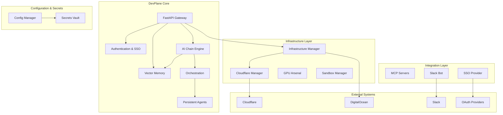

# Project Architecture Audit & Refactoring Plan

## 1. Current Project Structure Analysis

The project `mothership_optimized` is a comprehensive AI control plane with the following key modules:

- **Core Services**: `devplane/auth.py`, `devplane/db.py`, `devplane/models.py`, `devplane/providers.py`, `devplane/roles.py`, `devplane/security.py`
- **API Layer**: `devplane/api/` – FastAPI routers for dashboard endpoints (chains, config, infra, mesh, projects, secrets, tools, workflows, agents, credits, providers)
- **AI Agent & Chain**: `devplane/chain/` – LangGraph‑based persistent multi‑agent state machine, tournament engine, mesh orchestrator, optimizer
- **Infrastructure Management**: `devplane/infra/` – DigitalOcean droplet provisioning, Cloudflare DNS/tunnel management, GPU arsenal, Kasm workspace, sandbox security, MCP server
- **Orchestration**: `devplane/orchestration/` – Personal, swarm, and workflow orchestration with caching
- **Memory & Storage**: `devplane/memory/` – Vector store (Qdrant) integration
- **Secrets Management**: `devplane/secrets/` – Vault‑style secret storage
- **Security**: `devplane/security/` – SSH manager, credential provider, audit logging
- **Integrations**: `devplane/slack/` (Slack bot), `devplane/sso/` (OAuth2/JWT), `devplane/webauthn/` (FIDO2)
- **MCP Servers**: `devplane/mcp_servers/` – Bridges to external AI frameworks (CrewAI, Haystack, LlamaIndex, etc.)
- **Static Web UI**: `static/` – HTML/CSS/JS dashboard
- **Deployment Scripts**: `deploy.py`, `provision‑and‑deploy.py`, `deploy‑glondor.sh`, `setup‑glondor.sh`, `fix‑cloudflare‑auth.py`
- **Configuration & Documentation**: `.env.example`, `DEPLOYMENT.md`, `USER_GUIDE.md`, `AGENTS.md`, `GLONDOR‑SETUP.md`

### Strengths
- Modular separation of concerns (API, infra, chain, orchestration)
- Comprehensive infrastructure automation (DigitalOcean, Cloudflare)
- Built‑in security layers (MFA, WebAuthn, audit logging)
- Support for multiple AI providers and agent frameworks
- Docker‑based deployment with Cloudflare Tunnels

### Weaknesses
- **Domain‑specific hardcoding** – many scripts and configuration files assume the domain `glondor.xyz`
- **Temporary files clutter** – numerous `tmp_*` files in the root directory
- **Duplicate deployment logic** – multiple scripts with overlapping functionality
- **Configuration scattered** – some defaults are hardcoded in Python files, others in environment variables
- **Secret leakage risk** – `.env` file appears to be committed (contains API tokens)
- **Lack of a unified configuration management** – no single source of truth for environment‑specific variables
- **Test files mixed with production code** – `test_*.py` files reside in the project root

## 2. Temporary Files & Artifacts

The following files are temporary and can be safely removed:

```
tmp_auth_diff.txt
tmp_check_dns.py
tmp_convert.py
tmp_deploy_game.py
tmp_devplane_logs_utf8.txt
tmp_devplane_logs.txt
tmp_devplane_logs2.txt
tmp_diff_utf8.txt
tmp_diff.txt
tmp_docker_compose.yml
tmp_drops_pretty.json
tmp_drops.json
tmp_fix.py
tmp_fix2.py
tmp_game_builder_err.txt
tmp_game_builder.py
tmp_get_token.py
tmp_list_drops.py
tmp_mcp.py
tmp_spinup.py
tmp_test_mcp_extended.py
```

**Note**: `server.log` is an active log file; consider implementing log rotation and moving it to a dedicated `logs/` directory.

## 3. Hardcoded Domain‑Specific Configurations

| File | Hardcoded Value | Recommended Action |
|------|-----------------|-------------------|
| `deploy.py` | `DOMAIN = "glondor.xyz"` | Replace with environment variable `DEPLOYMENT_DOMAIN` |
| `provision‑and‑deploy.py` | `DOMAIN = "glondor.xyz"` | Replace with environment variable `DEPLOYMENT_DOMAIN` |
| `deploy‑glondor.sh` | `DOMAIN="glondor.xyz"` | Replace with command‑line argument or env var |
| `deploy‑glondor‑prod.sh` | `DOMAIN="glondor.xyz"` | Replace with command‑line argument or env var |
| `fix‑cloudflare‑auth.py` | `DOMAIN = "glondor.xyz"` | Replace with environment variable `CLOUDFLARE_DOMAIN` |
| `devplane/infra/cloudflare.py` | `domain = os.environ.get("CLOUDFLARE_DOMAIN", "glondor.xyz")` | Keep default but ensure it is overridden via env |
| `devplane/infra/configure‑cloudflare.py` | `self.domain = os.getenv('DOMAIN_NAME', 'glondor.xyz')` | Same as above |
| `setup‑glondor.sh` | `DOMAIN="glondor.xyz"` | Replace with env var |
| `GLONDOR‑SETUP.md` | Documentation references to `glondor.xyz` | Update to use placeholders |
| `.env` (committed?) | `CLOUDFLARE_DOMAIN='glondor.xyz'` | Remove from version control, use `.env.example` |

Additionally, the following hardcoded infrastructure settings should be externalized:

- `DROPLET_NAME`, `DROPLET_IMAGE`, `DROPLET_REGION` (`provision‑and‑deploy.py`)
- `TUNNEL_NAME` (multiple files)
- `DEPLOY_DIR` (multiple scripts)
- Default droplet sizes and cost tables

## 4. Deployment Pipeline Weaknesses

1. **Multiple overlapping scripts** – `deploy.py`, `provision‑and‑deploy.py`, `deploy‑glondor.sh`, `deploy‑glondor‑prod.sh` all perform similar tasks with different assumptions.
2. **No environment‑specific configuration** – scripts assume a single production environment (`glondor.xyz`).
3. **Secrets embedded in scripts** – Cloudflare and DigitalOcean tokens are read from `.env` but the `.env` file may be accidentally committed.
4. **Lack of idempotency** – Some scripts do not check for existing resources before creating new ones.
5. **No rollback mechanism** – If a deployment fails, the system may be left in an inconsistent state.
6. **Mixed responsibility** – Scripts handle both infrastructure provisioning (DigitalOcean droplets) and application deployment (Docker Compose). This violates separation of concerns.
7. **Hardcoded timeouts and retries** – No configurable timeout settings for SSH, API calls, or health checks.

## 5. Proposed Architecture

### 5.1 Core Principles
- **Configuration‑over‑code** – All environment‑specific values (domains, regions, sizes) must be defined in environment variables or a structured config file (e.g., `config.yaml`).
- **Separation of concerns** – Clear boundaries between:
  - **Core AI Logic** (agent, chain, memory, orchestration)
  - **Infrastructure Abstraction** (cloud providers, DNS, tunnels)
  - **API Gateway** (REST endpoints, authentication)
  - **Integration Adapters** (MCP servers, Slack, SSO)
- **Unified deployment pipeline** – A single, parameterized deployment system that can target multiple environments (dev, staging, prod) and multiple domains.
- **Secret management** – Use a dedicated secret store (Bitwarden, HashiCorp Vault) or at least ensure secrets are never committed.

### 5.2 High‑Level Architecture Diagram



### 5.3 Proposed Directory Structure

```
mothership_optimized/
├── .github/                          # CI/CD workflows
├── config/                           # Configuration files
│   ├── environments/
│   │   ├── dev.yaml
│   │   ├── staging.yaml
│   │   └── production.yaml
│   └── schema.py                     # Pydantic validation
├── devplane/                         # Core Python package
│   ├── core/                         # Domain‑agnostic utilities
│   │   ├── config.py                 # Configuration loader
│   │   ├── logging.py
│   │   └── exceptions.py
│   ├── domain/                       # Core business logic
│   │   ├── agent/                    # AI agent (LangGraph)
│   │   ├── chain/                    # Tournament, mesh, optimizer
│   │   ├── memory/                   # Vector store interface
│   │   └── orchestration/            # Personal, swarm, workflow
│   ├── infrastructure/               # Cloud abstractions
│   │   ├── providers/                # DigitalOcean, Cloudflare, GPU
│   │   ├── sandbox.py
│   │   └── manager.py                # Unified infra manager
│   ├── api/                          # FastAPI routers (unchanged)
│   ├── integrations/                 # External integrations
│   │   ├── slack/
│   │   ├── sso/
│   │   ├── webauthn/
│   │   └── mcp_servers/              # MCP bridges
│   ├── security/                     # Auth, audit, SSH, credentials
│   └── secrets/                      # Vault implementation
├── deployments/                      # Deployment automation
│   ├── terraform/                    # Infrastructure‑as‑code (optional)
│   ├── scripts/                      # Reusable deployment scripts
│   │   ├── deploy.py                 # Unified deployment entrypoint
│   │   ├── provision.py              # Infrastructure provisioning
│   │   └── configure‑cloudflare.py
│   └── docker/                       # Docker‑related files
│       ├── Dockerfile
│       ├── docker‑compose.yml
│       └── docker‑compose.override.yml
├── static/                           # Web UI (unchanged)
├── tests/                            # All test files moved here
├── logs/                             # Log directory (git‑ignored)
├── plans/                            # Architecture plans (this document)
├── .env.example                      # Template for environment variables
├── pyproject.toml                    # Modern Python project metadata
├── README.md
└── Makefile                          # Common development tasks
```

### 5.4 Configuration Management

Introduce a `Config` class that loads settings from:
1. Environment variables (highest priority)
2. Environment‑specific YAML files (`config/environments/`)
3. Default values defined in Pydantic models

Example:
```python
# devplane/core/config.py
from pydantic_settings import BaseSettings

class Settings(BaseSettings):
    domain: str = "localhost"
    cloudflare_account_id: str = ""
    digitalocean_token: str = ""
    cors_origins: list[str] = ["http://localhost:3000", "http://localhost:8000"]
    # … other settings

settings = Settings()
```

### 5.5 Deployment Pipeline Redesign

1. **Unified deployment entrypoint** – A single `deploy` command that accepts an environment flag (`--env dev|staging|prod`).
2. **Phase‑based execution**:
   - **Discovery** – Check existing resources (dry‑run)
   - **Provision** – Create missing infrastructure (droplets, DNS records, tunnels)
   - **Configure** – Generate environment‑specific `.env` and configuration files
   - **Deploy** – Run Docker Compose or Kubernetes manifests
   - **Verify** – Health checks, smoke tests
3. **Secret injection** – Secrets are fetched from a secure store (Bitwarden, AWS Secrets Manager) and injected as environment variables at runtime.
4. **Rollback support** – Each deployment creates a snapshot (e.g., Docker image tag) that can be rolled back.

## 6. Cleanup & Refactoring Steps

### Phase 1 – Immediate Cleanup
- [ ] Delete all `tmp_*` files listed in Section 2.
- [ ] Move `test_*.py` files to a `tests/` directory and update import paths.
- [ ] Verify `.env` is in `.gitignore` and remove it from version control if committed.
- [ ] Create `logs/` directory and redirect `server.log` there.

### Phase 2 – Configuration Externalization
- [ ] Replace every hardcoded `DOMAIN = "glondor.xyz"` with an environment variable (e.g., `DEPLOYMENT_DOMAIN`).
- [ ] Externalize droplet configuration (`DROPLET_NAME`, `DROPLET_IMAGE`, `DROPLET_REGION`) via environment variables.
- [ ] Update deployment scripts to accept command‑line arguments for domain and other settings.
- [ ] Create a `config/environments/` directory with sample YAML files.

### Phase 3 – Consolidate Deployment Scripts
- [ ] Design a unified `deployments/scripts/deploy.py` that can replace `deploy.py`, `provision‑and‑deploy.py`, and the `deploy‑glondor*.sh` scripts.
- [ ] Refactor common functions (SSH helpers, Cloudflare API wrappers, DigitalOcean clients) into a shared library.
- [ ] Add idempotency checks and rollback stubs.

### Phase 4 – Modularize Codebase
- [ ] Reorganize `devplane/` according to the proposed directory structure.
- [ ] Ensure each module has a clear single responsibility.
- [ ] Update import statements across the project.

### Phase 5 – Implement Configuration Manager
- [ ] Create `devplane/core/config.py` with Pydantic settings.
- [ ] Migrate all configuration reads to use the new `settings` object.
- [ ] Validate configuration at startup.

### Phase 6 – Secret Management
- [ ] Integrate with Bitwarden CLI or HashiCorp Vault for production secrets.
- [ ] Remove any hardcoded API keys from source code.
- [ ] Update `.env.example` with placeholder values.

### Phase 7 – Testing & Validation
- [ ] Write integration tests for the new deployment pipeline.
- [ ] Test multi‑environment deployments (dev, staging, prod).
- [ ] Validate that all existing API endpoints and agent functions still work.

## 7. Next Steps

1. **Review this plan** with the team and adjust as needed.
2. **Prioritize phases** based on business needs.
3. **Create a detailed task breakdown** for each phase.
4. **Begin implementation** with Phase 1 (cleanup) to reduce immediate technical debt.

---
*Report generated by Kilo Code on 2026‑03‑08*