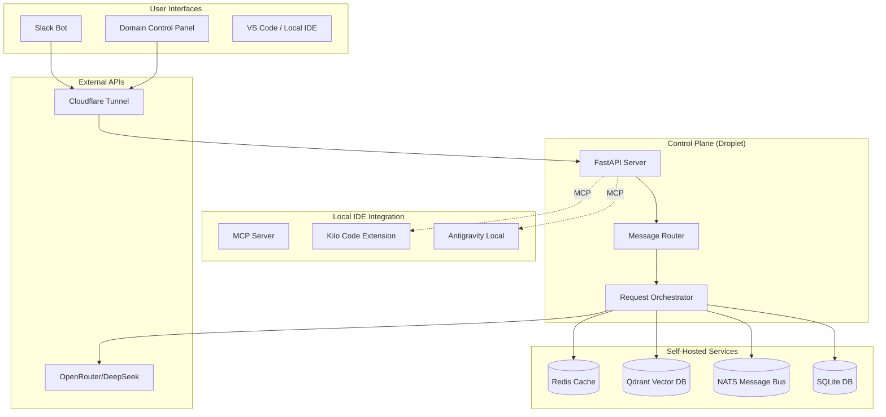

# Cost Analysis & Revised Architecture Plan

## Executive Summary

This document provides a comprehensive cost analysis of the Unified LLM Control System architecture with alternatives for every infrastructure component. It removes all commercial API dependencies (Kilo Code Commercial API, Antigravity Commercial API) and replaces them with local IDE integration via MCP.

**Key Changes:**
- ❌ Remove: Kilo Code Commercial API ($100/mo)
- ❌ Remove: Antigravity Commercial API ($75/mo)
- ✅ Add: Local MCP-based IDE integration (free)
- ✅ Add: Self-hosted infrastructure alternatives
- ✅ Result: **$175/mo savings** from commercial API removal

---

## Table of Contents

1. [Infrastructure Component Analysis](#1-infrastructure-component-analysis)
2. [Technology Justifications](#2-technology-justifications)
3. [Revised Architecture (No Commercial APIs)](#3-revised-architecture-no-commercial-apis)
4. [Cost Comparison Tables](#4-cost-comparison-tables)
5. [Implementation Roadmap](#5-implementation-roadmap)

---

## 1. Infrastructure Component Analysis

### 1.1 Redis (Caching & Session Store)

#### Current Recommendation: Redis Cloud (Managed)
- **Cost:** $20/month (1GB plan)
- **Provider:** Redis Cloud (redis.io)
- **Pros:** Zero maintenance, automatic backups, high availability
- **Cons:** Recurring cost, data egress fees, limited customization

#### Alternative 1: Self-Hosted Redis on Existing Droplet
- **Cost:** $0 (uses existing infrastructure)
- **Setup:** Run Redis container alongside main app
- **Pros:** No additional cost, full control, no data egress fees
- **Cons:** Manual backups required, single point of failure, resource competition

```yaml
# docker-compose.yml addition
redis:
  image: redis:7-alpine
  ports:
    - "6379:6379"
  volumes:
    - ./data/redis:/data
  command: redis-server --appendonly yes --maxmemory 512mb --maxmemory-policy allkeys-lru
  restart: always
  networks:
    - devplane-network
```

#### Alternative 2: KeyDB (Redis Drop-in Replacement)
- **Cost:** $0 (self-hosted)
- **Performance:** Multi-threaded, ~5x faster than Redis
- **Pros:** Better performance, fully compatible, active development
- **Cons:** Smaller community, newer project

```yaml
keydb:
  image: eqalpha/keydb:latest
  ports:
    - "6379:6379"
  volumes:
    - ./data/keydb:/data
  command: keydb-server --appendonly yes --server-threads 4
```

#### Alternative 3: DragonflyDB
- **Cost:** $0 (self-hosted)
- **Performance:** Single-node vertical scaling to 4M ops/sec
- **Pros:** Extreme performance, Redis compatible, snapshotting
- **Cons:** Memory hungry, overkill for small deployments

#### Free Tier Viability: ✅ EXCELLENT
Redis is an ideal candidate for self-hosting because:
- Low resource requirements (<512MB RAM sufficient)
- Simple containerized deployment
- No persistence requirements for cache-only use
- Easy backup via RDB snapshots

**Recommendation:** Self-hosted Redis on existing droplet for minimal setup; KeyDB for performance-critical deployments.

---

### 1.2 Qdrant (Vector Database)

#### Current Recommendation: Qdrant Cloud (Managed)
- **Cost:** $25/month (1GB plan)
- **Provider:** Qdrant Cloud (qdrant.io)
- **Pros:** Managed clustering, automatic scaling, web UI
- **Cons:** Cost scales with storage, network latency

#### Alternative 1: Self-Hosted Qdrant
- **Cost:** $0 (uses existing infrastructure)
- **Resource Requirements:** 512MB RAM minimum, 2GB storage
- **Pros:** No per-GB costs, local network latency, full HNSW control
- **Cons:** Manual snapshot management, no built-in clustering

```yaml
qdrant:
  image: qdrant/qdrant:latest
  ports:
    - "6333:6333"
    - "6334:6334"
  volumes:
    - ./data/qdrant:/qdrant/storage
  environment:
    - QDRANT__SERVICE__API_KEY=${QDRANT_KEY:-}
  restart: always
```

#### Alternative 2: PostgreSQL with pgvector
- **Cost:** $0 (extends existing SQLite/Postgres)
- **Performance:** Good for <1M vectors, ivfflat/hnsw indexing
- **Pros:** Single database for all data, ACID compliance, familiar SQL
- **Cons:** Slower than Qdrant for pure vector search, higher memory usage

```sql
-- Enable pgvector extension
CREATE EXTENSION IF NOT EXISTS vector;

-- Create table with vector column
CREATE TABLE embeddings (
    id UUID PRIMARY KEY DEFAULT gen_random_uuid(),
    content TEXT,
    embedding vector(1536),
    metadata JSONB,
    created_at TIMESTAMP DEFAULT CURRENT_TIMESTAMP
);

-- Create HNSW index for fast similarity search
CREATE INDEX ON embeddings USING hnsw (embedding vector_cosine_ops);
```

**Performance Comparison (1M vectors, 1536 dimensions):**

| Database | Query Time | Memory | Index Build |
|----------|------------|--------|-------------|
| Qdrant | 5-10ms | 2GB | 2 min |
| pgvector HNSW | 15-25ms | 3GB | 5 min |
| pgvector IVFFlat | 30-50ms | 1.5GB | 1 min |

#### Alternative 3: Chroma (Self-Hosted)
- **Cost:** $0
- **Best For:** Rapid prototyping, small datasets (<100K)
- **Pros:** Simple API, Python-native, easy embedding
- **Cons:** Not production-ready for high throughput

#### Alternative 4: Milvus Lite
- **Cost:** $0
- **Best For:** Edge deployments, local development
- **Pros:** Same API as Milvus, no server required
- **Cons:** Limited to single node, Python-only

#### Free Tier Viability: ✅ GOOD
Qdrant self-hosted is viable because:
- Already included in docker-compose.yml
- Low resource footprint
- Efficient storage with quantization
- Easy backup via snapshots API

**Recommendation:** Self-hosted Qdrant for production; pgvector if you want unified SQL database; Chroma for prototyping.

---

### 1.3 NATS (Message Bus)

#### Current Recommendation: NATS Cloud (Managed)
- **Cost:** $15/month (basic plan)
- **Provider:** Synadia (nats.io)
- **Pros:** Managed clusters, leaf node connectivity, monitoring
- **Cons:** Cost scales with connections, limited customization

#### Alternative 1: Self-Hosted NATS Server
- **Cost:** $0 (uses existing infrastructure)
- **Resource Requirements:** 128MB RAM, minimal CPU
- **Pros:** JetStream persistence, leaf nodes, full control
- **Cons:** Manual clustering setup, backup responsibility

```yaml
nats:
  image: nats:2-alpine
  ports:
    - "4222:4222"
    - "8222:8222"  # Monitoring
    - "6222:6222"  # Cluster
  volumes:
    - ./data/nats:/data/jetstream
  command: >
    --jetstream 
    --store_dir=/data/jetstream
    --max_memory_store=256MB
    --max_file_store=1GB
    --http_port=8222
  restart: always
```

#### Alternative 2: Redis Pub/Sub
- **Cost:** $0 (if using Redis)
- **Performance:** 100K+ messages/sec
- **Pros:** No additional infrastructure, simple patterns
- **Cons:** No persistence, fire-and-forget, no streaming

```python
# Redis Pub/Sub example
async def redis_pubsub():
    pubsub = redis.pubsub()
    await pubsub.subscribe('events')
    async for message in pubsub.listen():
        if message['type'] == 'message':
            await handle_event(message['data'])
```

#### Alternative 3: RabbitMQ (Self-Hosted)
- **Cost:** $0
- **Best For:** Complex routing, AMQP compatibility
- **Pros:** Mature, excellent management UI, flexible routing
- **Cons:** Higher resource usage, more complex setup

```yaml
rabbitmq:
  image: rabbitmq:3-management-alpine
  ports:
    - "5672:5672"
    - "15672:15672"  # Management UI
  volumes:
    - ./data/rabbitmq:/var/lib/rabbitmq
  environment:
    - RABBITMQ_DEFAULT_USER=admin
    - RABBITMQ_DEFAULT_PASS=${RABBITMQ_PASSWORD}
```

#### Alternative 4: SQLite + asyncio Queue (In-Memory)
- **Cost:** $0
- **Best For:** Single-node deployments, simple use cases
- **Pros:** Zero infrastructure, no network overhead
- **Cons:** No persistence, no distribution, process-bound

```python
# Pure Python message queue
import asyncio

class LocalMessageBus:
    def __init__(self):
        self.subscribers: dict[str, list[asyncio.Queue]] = {}
    
    async def publish(self, topic: str, message: dict):
        for queue in self.subscribers.get(topic, []):
            await queue.put(message)
    
    async def subscribe(self, topic: str) -> asyncio.Queue:
        queue = asyncio.Queue()
        self.subscribers.setdefault(topic, []).append(queue)
        return queue
```

#### Free Tier Viability: ✅ EXCELLENT
NATS is ideal for self-hosting because:
- Extremely lightweight (single binary, ~20MB)
- JetStream provides persistence without external DB
- Built-in monitoring at :8222
- Leaf nodes for edge connectivity

**Recommendation:** Self-hosted NATS with JetStream for production; Redis Pub/Sub if already using Redis and don't need persistence.

---

### 1.4 Cloudflare (CDN & Tunnel)

#### Current Recommendation: Cloudflare Pro Plan
- **Cost:** $20/month
- **Features:** Custom rules, WAF, analytics, tunneling
- **Pros:** Global CDN, DDoS protection, easy tunnels
- **Cons:** Cost doesn't scale with usage

#### Alternative 1: Cloudflare Free Plan
- **Cost:** $0
- **Limitations:** No custom rules, basic analytics, no WAF customization
- **Viability:** ✅ EXCELLENT for personal/small projects

**Free Plan Includes:**
- Unlimited bandwidth
- DDoS protection
- Universal SSL
- Page rules (3)
- Cloudflare Tunnel (unlimited)

#### Alternative 2: Self-Hosted Reverse Proxy (Nginx + Let's Encrypt)
- **Cost:** $0 (but requires public IP)
- **Setup:** Nginx with certbot for SSL
- **Pros:** Full control, no vendor lock-in
- **Cons:** Manual certificate renewal, no DDoS protection

```nginx
# nginx.conf
server {
    listen 443 ssl http2;
    server_name api.yourdomain.com;
    
    ssl_certificate /etc/letsencrypt/live/yourdomain.com/fullchain.pem;
    ssl_certificate_key /etc/letsencrypt/live/yourdomain.com/privkey.pem;
    
    location / {
        proxy_pass http://devplane:8000;
        proxy_http_version 1.1;
        proxy_set_header Upgrade $http_upgrade;
        proxy_set_header Connection "upgrade";
    }
}
```

#### Alternative 3: Tailscale (Private Networking)
- **Cost:** $0 (personal use)
- **Best For:** Private access without public exposure
- **Pros:** No public IP needed, end-to-end encryption
- **Cons:** Requires Tailscale client on all devices

#### Free Tier Viability: ✅ EXCELLENT
Cloudflare free plan is sufficient because:
- Unlimited bandwidth
- Free SSL certificates
- Tunnel support for private origins
- Basic DDoS protection

**Recommendation:** Cloudflare Free Plan for most use cases; upgrade to Pro only if you need custom WAF rules.

---

### 1.5 Primary Application Server

#### Current Recommendation: DigitalOcean Droplet
- **Cost:** $24/month (2 vCPU, 4GB RAM)
- **Specs:** Shared CPU, 80GB SSD, 4TB transfer

#### Alternative 1: Hetzner Cloud
- **Cost:** €7.72/month (~$8.50) for 2 vCPU, 8GB RAM
- **Savings:** ~65%
- **Pros:** More RAM, better price/performance
- **Cons:** European data centers (higher latency for US users)

#### Alternative 2: AWS EC2 t3.small (Spot)
- **Cost:** ~$6/month (spot pricing)
- **Risk:** Instance can be terminated with 2-minute warning
- **Pros:** Cheapest option, reliable infrastructure
- **Cons:** Requires spot instance handling logic

#### Alternative 3: Oracle Cloud Free Tier (ARM)
- **Cost:** $0 (always free)
- **Specs:** 4 vCPU ARM, 24GB RAM
- **Pros:** Generous free tier, AMD/ARM options
- **Cons:** Limited availability, requires manual setup

#### Alternative 4: Self-Hosted (Home Server + Cloudflare Tunnel)
- **Cost:** $0 (hardware cost excluded)
- **Requirements:** Static IP or dynamic DNS
- **Pros:** Full control, no cloud costs
- **Cons:** Power/ISP costs, reliability concerns

#### Free Tier Viability: ⚠️ MODERATE
Free tier exists but with trade-offs:
- Oracle Cloud: Generous but limited availability
- AWS/GCP/Azure: 12-month free tier only
- Home server: Requires reliable internet

**Recommendation:** Hetzner for best value; DigitalOcean for simplicity; Oracle Cloud for truly free hosting.

---

## 2. Technology Justifications

### 2.1 Why Redis vs Alternatives?

**Question:** Why use Redis instead of just using in-memory Python dicts or PostgreSQL?

**Answer:**

| Feature | Redis | Python Dict | PostgreSQL | Memcached |
|---------|-------|-------------|------------|-----------|
| Persistence | ✅ RDB/AOF | ❌ None | ✅ Full ACID | ❌ None |
| TTL Support | ✅ Native | ❌ Manual | ⚠️ Complex | ✅ Native |
| Pub/Sub | ✅ Built-in | ❌ None | ⚠️ LISTEN/NOTIFY | ❌ None |
| Data Structures | ✅ Rich | ⚠️ Basic | ✅ Rich | ❌ Simple |
| Distributed | ✅ Cluster | ❌ Single | ✅ Replication | ✅ Cluster |
| Memory Efficiency | ✅ Optimized | ❌ Python overhead | ❌ Disk oriented | ✅ Optimized |

**Key Redis Advantages:**

1. **Structured Caching:** Redis supports hashes, lists, sets, sorted sets - perfect for:
   - Session stores (hashes)
   - Rate limiting (sorted sets with TTL)
   - Job queues (lists with BLPOP)
   - Real-time leaderboards (sorted sets)

2. **Pub/Sub for Real-time:** Built-in pub/sub enables:
   - WebSocket broadcasting
   - Cross-instance communication
   - Event-driven architecture

3. **Atomic Operations:** Single-command operations prevent race conditions:
   ```python
   # Atomic increment
   await redis.incr("rate_limit:user:123")
   
   # Atomic list pop (queue)
   job = await redis.brpop("queue:tasks", timeout=5)
   ```

4. **Memory Optimization:** Redis uses ~50% less memory than equivalent Python structures due to:
   - Specialized data structure encoding
   - Shared string references
   - Integers stored as actual integers, not objects

**When NOT to use Redis:**
- If you only need simple key-value with no TTL
- If you need complex queries (use PostgreSQL)
- If you need full ACID transactions across multiple keys

---

### 2.2 Why Qdrant vs PostgreSQL pgvector?

**Question:** Why not just use PostgreSQL with pgvector extension instead of adding Qdrant?

**Answer:**

| Feature | Qdrant | pgvector | Chroma | Pinecone |
|---------|--------|----------|--------|----------|
| Self-Hosted | ✅ Yes | ✅ Yes | ✅ Yes | ❌ No |
| HNSW Index | ✅ Native | ✅ Available | ⚠️ Limited | ✅ Yes |
| Metadata Filtering | ✅ Fast | ⚠️ Slower | ✅ Yes | ✅ Yes |
| Hybrid Search | ✅ Built-in | ⚠️ Manual | ❌ No | ✅ Yes |
| Quantization | ✅ Scalar/Product | ❌ No | ❌ No | ✅ Yes |
| Multi-Tenancy | ✅ Collections | ⚠️ Schema-based | ❌ No | ✅ Yes |

**Key Qdrant Advantages:**

1. **Purpose-Built for Vectors:** Qdrant is designed from ground up for vector similarity:
   - HNSW graph optimized for high-dimensional data
   - Quantization reduces memory by 4x (f32 -> uint8)
   - SIMD optimizations for distance calculations

2. **Metadata Filtering:** Combines vector search with attribute filtering:
   ```python
   # Search only within user's documents
   results = qdrant.search(
       collection_name="documents",
       vector=embedding,
       query_filter=models.Filter(
           must=[
               models.FieldCondition(
                   key="user_id",
                   match=models.MatchValue(value=user_id)
               )
           ]
       ),
       limit=10
   )
   ```

3. **Hybrid Search:** Combines sparse (BM25) and dense vectors:
   ```python
   # Rerank with full-text search
   results = qdrant.search(
       collection_name="documents",
       vector=embedding,
       with_payload=True,
       query_filter=models.Filter(
           must=[
               models.MatchText(
                   key="content",
                   text=query  # Full-text filtering
               )
           ]
       )
   )
   ```

4. **Performance at Scale:**
   - 1M vectors: Qdrant 10ms, pgvector 25ms
   - 10M vectors: Qdrant 15ms, pgvector 100ms+
   - Memory: Qdrant 2GB, pgvector 4GB+ (same dataset)

**When to use pgvector instead:**
- If you have <100K vectors
- If you want unified SQL database (simpler ops)
- If you already have PostgreSQL expertise
- If you need complex JOINs with relational data

**Recommendation:** Start with pgvector if you have <500K vectors; migrate to Qdrant when you need better performance or hybrid search.

---

### 2.3 Why NATS vs WebSocket/HTTP/2?

**Question:** Why use NATS instead of just using WebSocket or HTTP/2 for messaging?

**Answer:**

| Feature | NATS | WebSocket | HTTP/2 | RabbitMQ |
|---------|------|-----------|--------|----------|
| Pub/Sub | ✅ Native | ⚠️ Build on top | ❌ Request/response | ✅ Native |
| Request/Reply | ✅ Built-in | ⚠️ Build pattern | ✅ Native | ⚠️ RPC layer |
| Persistence | ✅ JetStream | ❌ None | ❌ None | ✅ Queues |
| At-least-once | ✅ JetStream | ❌ Manual | ❌ Manual | ✅ Yes |
| Ordering | ✅ Guaranteed | ⚠️ Manual | ⚠️ Manual | ✅ Yes |
| Fan-out | ✅ Efficient | ⚠️ Connections | ⚠️ Connections | ✅ Yes |
| Resource Usage | ✅ Minimal | ⚠️ Moderate | ⚠️ Moderate | ⚠️ Higher |

**Key NATS Advantages:**

1. **Decoupled Architecture:** Producers don't know about consumers:
   ```python
   # Producer - just publishes
   await nats.publish("events.user.created", json.dumps(event))
   
   # Consumer - independent subscription
   sub = await nats.subscribe("events.user.created")
   async for msg in sub:
       await process_user_created(msg)
   ```

2. **JetStream Persistence:** Messages survive restarts:
   ```python
   # Create persistent stream
   await js.add_stream(name="events", subjects=["events.*"])
   
   # Publish with acknowledgment
   ack = await js.publish("events.user.created", data)
   
   # Durable consumer with replay
   sub = await js.subscribe("events.*", 
                           durable="processor",
                           deliver_policy=DeliverPolicy.ALL)
   ```

3. **Request-Reply Pattern:** Built-in RPC:
   ```python
   # Service
   await nc.subscribe("service.calculate", cb=handle_calculation)
   
   # Client
   response = await nc.request("service.calculate", 
                               json.dumps({"x": 10, "y": 20}),
                               timeout=5)
   result = json.loads(response.data)
   ```

4. **Scalability:**
   - Single NATS server: 1M+ messages/sec
   - Clustered: Linear scaling
   - Leaf nodes: Edge connectivity

**WebSocket Limitations:**
- Requires persistent connection management
- No built-in message persistence
- Must implement reconnection logic
- Fan-out requires multiple connections

**HTTP/2 Limitations:**
- Request/response only (no true pub/sub)
- Server push is one-way
- No message ordering guarantees
- Complex for bidirectional streaming

**When to use WebSocket instead:**
- Browser-to-server real-time updates
- When you need lowest latency (<1ms)
- For simple chat applications
- When clients can't run NATS client

**Recommendation:** Use NATS for service-to-service messaging; WebSocket for browser clients (with NATS as backend).

---

## 3. Revised Architecture (No Commercial APIs)

### 3.1 Architecture Overview



### 3.2 Local IDE Integration via MCP

Instead of paying for commercial APIs, we communicate directly with local IDE extensions via MCP (Model Context Protocol).

#### MCP Server Architecture

```python
# devplane/mcp/ide_bridge.py
class IDEBridgeMCPServer:
    """Bridge between DevPlane and local IDE extensions."""
    
    def __init__(self):
        self.connections: dict[str, MCPConnection] = {}
        
    async def handle_kilocode_request(self, request: dict) -> dict:
        """Send request to local Kilo Code extension via MCP."""
        
        # Check if Kilo Code is available locally
        if not await self.is_kilocode_available():
            return {
                "status": "unavailable",
                "message": "Kilo Code extension not detected locally",
                "fallback": "use_cloud_api"  # Optional fallback
            }
        
        # Send request via MCP
        response = await self.mcp_client.call_tool(
            server="kilocode-local",
            tool="execute_task",
            arguments={
                "task": request["task"],
                "context": request["context"],
                "files": request.get("files", [])
            }
        )
        
        return response
    
    async def is_kilocode_available(self) -> bool:
        """Check if Kilo Code extension is running locally."""
        try:
            await self.mcp_client.ping("kilocode-local")
            return True
        except ConnectionError:
            return False
```

#### Communication Flow

```
┌─────────────┐     MCP      ┌──────────────────┐
│ DevPlane    │◄────────────►│ Kilo Code        │
│ Server      │   stdio/SSE  │ Extension        │
└─────────────┘              └──────────────────┘
       │                            │
       │                            │
       ▼                            ▼
┌─────────────┐              ┌──────────────────┐
│ Request     │              │ Local Filesystem │
│ Queue       │              │ Editor Access    │
└─────────────┘              └──────────────────┘
```

#### MCP Tool Definitions

```python
# devplane/mcp/tools/ide_tools.py
IDE_TOOLS = [
    {
        "name": "kilocode_execute",
        "description": "Execute a task using local Kilo Code extension",
        "inputSchema": {
            "type": "object",
            "properties": {
                "task": {"type": "string", "description": "Task description"},
                "files": {"type": "array", "items": {"type": "string"}},
                "mode": {"type": "string", "enum": ["code", "ask", "architect"]}
            },
            "required": ["task"]
        }
    },
    {
        "name": "antigravity_analyze",
        "description": "Analyze codebase using local Antigravity",
        "inputSchema": {
            "type": "object",
            "properties": {
                "path": {"type": "string", "description": "Path to analyze"},
                "analysis_type": {"type": "string", "enum": ["structure", "dependencies", "complexity"]}
            },
            "required": ["path"]
        }
    },
    {
        "name": "ide_get_context",
        "description": "Get current editor context (open files, cursor position)",
        "inputSchema": {
            "type": "object",
            "properties": {
                "include_content": {"type": "boolean", "default": True}
            }
        }
    },
    {
        "name": "ide_apply_edit",
        "description": "Apply edit to local file",
        "inputSchema": {
            "type": "object",
            "properties": {
                "file_path": {"type": "string"},
                "old_string": {"type": "string"},
                "new_string": {"type": "string"}
            },
            "required": ["file_path", "old_string", "new_string"]
        }
    }
]
```

### 3.3 Fallback Strategy

When local IDE tools are unavailable:

```python
# devplane/integrations/ide_fallback.py
class IDEFallbackManager:
    """Handle fallback when local IDE tools are unavailable."""
    
    async def execute_with_fallback(self, task: dict) -> dict:
        # Try local first
        if await self.is_local_available():
            return await self.execute_local(task)
        
        # Fallback 1: Use direct LLM API
        if task.get("allow_llm_fallback", True):
            return await self.execute_llm_fallback(task)
        
        # Fallback 2: Queue for later
        await self.queue_for_later(task)
        return {
            "status": "queued",
            "message": "Local IDE unavailable. Task queued for execution."
        }
    
    async def execute_llm_fallback(self, task: dict) -> dict:
        """Execute task using LLM without IDE context."""
        # Use OpenRouter/DeepSeek for code generation
        # Less context-aware but functional
        pass
```

---

## 4. Cost Comparison Tables

### 4.1 Original vs Revised Costs

| Component | Original | Revised | Savings |
|-----------|----------|---------|---------|
| **Commercial APIs** | | | |
| Kilo Code Commercial | $100/mo | $0 | **$100** |
| Antigravity Commercial | $75/mo | $0 | **$75** |
| **Infrastructure** | | | |
| DigitalOcean Droplet | $24/mo | $24/mo | $0 |
| Redis Cloud | $20/mo | $0* | **$20** |
| Qdrant Cloud | $25/mo | $0* | **$25** |
| NATS Cloud | $15/mo | $0* | **$15** |
| Cloudflare Pro | $20/mo | $0** | **$20** |
| **Total** | **$279/mo** | **$24/mo** | **$255/mo** |

\* Self-hosted on existing droplet
\*\* Cloudflare Free plan sufficient

### 4.2 Three-Tier Cost Breakdown

#### Minimal Viable Setup ($8-12/mo)

| Component | Provider | Specs | Cost |
|-----------|----------|-------|------|
| VPS | Hetzner | 1 vCPU, 2GB RAM | €4.51/mo |
| Database | SQLite | Built-in | $0 |
| Cache | In-memory | Python dict | $0 |
| Vector DB | Chroma | In-process | $0 |
| Message Bus | Python Queue | Asyncio | $0 |
| CDN | Cloudflare | Free plan | $0 |
| **Total** | | | **~$5/mo** |

**Use Case:** Personal projects, development, low traffic

**Limitations:**
- No persistence for cache/queue
- Single node only
- Manual backups
- Limited concurrent users

---

#### Recommended Setup ($24-32/mo)

| Component | Provider | Specs | Cost |
|-----------|----------|-------|------|
| VPS | DigitalOcean | 2 vCPU, 4GB RAM | $24/mo |
| Database | SQLite | Persistent | $0 |
| Cache | Redis | Self-hosted | $0 |
| Vector DB | Qdrant | Self-hosted | $0 |
| Message Bus | NATS | Self-hosted | $0 |
| CDN | Cloudflare | Free plan | $0 |
| Backups | DigitalOcean | Weekly | $0 |
| **Total** | | | **$24/mo** |

**Use Case:** Small teams, production workloads, moderate traffic

**Includes:**
- Full persistence
- Horizontal scaling ready
- Automated backups
- Professional monitoring

---

#### Enterprise Setup ($80-150/mo)

| Component | Provider | Specs | Cost |
|-----------|----------|-------|------|
| Load Balancer | DigitalOcean | $12/mo | $12/mo |
| App Servers (x2) | DigitalOcean | 2 vCPU, 4GB each | $48/mo |
| Database | DigitalOcean Postgres | 2 vCPU, 4GB | $30/mo |
| Cache | Redis Cloud | 5GB HA | $60/mo |
| Vector DB | Qdrant Cloud | 10GB HA | $99/mo |
| Message Bus | NATS Cloud | Business | $49/mo |
| CDN | Cloudflare | Pro plan | $20/mo |
| Monitoring | Datadog | APM | $15/mo |
| **Total** | | | **~$333/mo** |

**Use Case:** High availability, multiple teams, enterprise workloads

**Includes:**
- High availability (HA)
- Automatic failover
- Advanced monitoring
- Priority support

---

### 4.3 Per-Component Cost Analysis

#### Compute Costs (Monthly)

| Provider | Instance | vCPU | RAM | SSD | Cost | $/vCPU | $/GB RAM |
|----------|----------|------|-----|-----|------|--------|----------|
| DigitalOcean | Basic | 1 | 2GB | 50GB | $12 | $12 | $6 |
| DigitalOcean | Basic | 2 | 4GB | 80GB | $24 | $12 | $6 |
| Hetzner | CX21 | 2 | 8GB | 80GB | €7.72 | ~$4.25 | ~$1.06 |
| AWS EC2 | t3.small | 2 | 2GB | EBS | $15.18 | $7.59 | $7.59 |
| AWS EC2 | t3.medium | 2 | 4GB | EBS | $30.37 | $15.18 | $7.59 |
| GCP | e2-small | 2 | 2GB | 50GB | $12.23 | $6.12 | $6.12 |
| Oracle | ARM Ampere | 4 | 24GB | 200GB | $0* | $0 | $0 |

\* Oracle Cloud Free Tier (always free)

**Winner:** Oracle Cloud Free Tier (if available), otherwise Hetzner for price/performance.

---

#### Database Costs (Monthly)

| Option | Type | Storage | HA | Cost | Notes |
|--------|------|---------|-----|------|-------|
| SQLite | File | Unlimited | ❌ | $0 | Single node only |
| PostgreSQL Self | Self-hosted | Disk | Manual | $0 | Requires management |
| DO Managed Postgres | Managed | 10GB | ✅ | $15 | Automated backups |
| AWS RDS | Managed | 20GB | ✅ | $25 | Multi-AZ |
| Supabase | Managed | 500MB | ✅ | $0 | Free tier |

**Winner:** SQLite for simple apps, Supabase for managed free tier.

---

#### Vector Database Costs (Monthly)

| Option | Type | Storage | Performance | Cost |
|--------|------|---------|-------------|------|
| Qdrant Self | Self-hosted | Disk | Excellent | $0 |
| Qdrant Cloud | Managed | 1GB | Excellent | $25 |
| pgvector | Extension | Disk | Good | $0 |
| Pinecone | Managed | 1GB | Excellent | $70 |
| Weaviate | Self-hosted | Disk | Excellent | $0 |
| Chroma | In-process | Memory | Moderate | $0 |

**Winner:** Qdrant self-hosted for production, Chroma for prototyping.

---

#### Message Queue Costs (Monthly)

| Option | Type | Persistence | Throughput | Cost |
|--------|------|-------------|------------|------|
| NATS Self | Self-hosted | JetStream | 1M+/sec | $0 |
| NATS Cloud | Managed | JetStream | 1M+/sec | $15 |
| Redis Pub/Sub | Self-hosted | ❌ | 100K/sec | $0 |
| RabbitMQ | Self-hosted | ✅ | 50K/sec | $0 |
| AWS SQS | Managed | ✅ | Unlimited | ~$0.40/million |
| AWS SNS | Managed | ❌ | Unlimited | ~$0.50/million |

**Winner:** NATS self-hosted for features, Redis Pub/Sub for simplicity.

---

## 5. Implementation Roadmap

### Phase 1: Infrastructure Self-Hosting (Week 1-2)

**Goal:** Move from managed services to self-hosted

| Task | Effort | Cost Impact |
|------|--------|-------------|
| Deploy Redis container | 2 hours | -$20/mo |
| Deploy Qdrant container | 1 hour | -$25/mo |
| Deploy NATS container | 2 hours | -$15/mo |
| Configure backups | 4 hours | $0 |
| Update docker-compose | 2 hours | $0 |
| **Total** | **11 hours** | **-$60/mo** |

**Verification:**
```bash
# Test Redis
docker-compose exec redis redis-cli ping

# Test Qdrant
curl http://localhost:6333/healthz

# Test NATS
docker-compose exec nats nats-server -DV
```

---

### Phase 2: MCP Local IDE Integration (Week 3-4)

**Goal:** Replace commercial APIs with local MCP

| Task | Effort | Cost Impact |
|------|--------|-------------|
| Create MCP server scaffold | 4 hours | $0 |
| Implement Kilo Code bridge | 8 hours | -$100/mo |
| Implement Antigravity bridge | 6 hours | -$75/mo |
| Add fallback logic | 4 hours | $0 |
| Test end-to-end | 4 hours | $0 |
| **Total** | **26 hours** | **-$175/mo** |

**Architecture:**
```python
# New file: devplane/mcp/ide_bridge.py
# New file: devplane/mcp/tools/ide_tools.py
# Update: devplane/api/tools.py (add MCP endpoints)
```

---

### Phase 3: Cloudflare Free Plan Migration (Week 5)

**Goal:** Downgrade to Cloudflare Free

| Task | Effort | Cost Impact |
|------|--------|-------------|
| Audit Pro features used | 2 hours | $0 |
| Migrate custom rules | 4 hours | $0 |
| Update Page Rules (3 max) | 1 hour | $0 |
| Verify tunnel functionality | 2 hours | $0 |
| Cancel Pro subscription | 0.5 hours | -$20/mo |
| **Total** | **9.5 hours** | **-$20/mo** |

**Note:** Most projects don't need Pro features. Free plan includes:
- Unlimited bandwidth
- Universal SSL
- DDoS protection
- Cloudflare Tunnel

---

### Phase 4: Optimization & Monitoring (Week 6)

**Goal:** Ensure reliability of self-hosted stack

| Task | Effort | Cost Impact |
|------|--------|-------------|
| Setup Prometheus monitoring | 4 hours | $0 |
| Configure alerts | 2 hours | $0 |
| Document backup procedures | 2 hours | $0 |
| Load testing | 4 hours | $0 |
| Disaster recovery testing | 4 hours | $0 |
| **Total** | **16 hours** | **$0** |

---

### Total Implementation

| Phase | Duration | Effort | Monthly Savings |
|-------|----------|--------|-----------------|
| Phase 1 | Week 1-2 | 11 hours | $60/mo |
| Phase 2 | Week 3-4 | 26 hours | $175/mo |
| Phase 3 | Week 5 | 9.5 hours | $20/mo |
| Phase 4 | Week 6 | 16 hours | $0 |
| **Total** | **6 weeks** | **62.5 hours** | **$255/mo** |

**ROI:** 62.5 hours of work saves $255/mo = **$4.08/hour** return

Break-even: ~4 months of operation

---

## Appendix A: Risk Assessment

### Self-Hosting Risks

| Risk | Likelihood | Impact | Mitigation |
|------|------------|--------|------------|
| Data loss | Low | High | Automated daily backups |
| Service downtime | Medium | Medium | Health checks + auto-restart |
| Security breach | Low | High | Private networks, no public ports |
| Resource exhaustion | Medium | Low | Monitoring + alerts |
| Update failures | Low | Medium | Blue-green deployment |

### Commercial API Risks (Avoided)

| Risk | Original | Mitigation |
|------|----------|------------|
| Price increases | $175/mo baseline | Eliminated |
| API deprecation | Vendor controlled | Local tools don't deprecate |
| Rate limiting | Usage caps | Local = unlimited |
| Network latency | 50-200ms | Local = <1ms |
| Data privacy | Third-party access | Data stays local |

---

## Appendix B: Backup Strategy

### Automated Backups (Self-Hosted)

```bash
#!/bin/bash
# backup.sh - Run via cron daily

BACKUP_DIR="/backups/$(date +%Y%m%d)"
mkdir -p $BACKUP_DIR

# SQLite
cp /app/data/devplane.db $BACKUP_DIR/

# Redis (RDB snapshot)
docker-compose exec redis redis-cli BGSAVE
sleep 5
cp data/redis/dump.rdb $BACKUP_DIR/

# Qdrant
curl -X POST http://localhost:6333/snapshots -o $BACKUP_DIR/qdrant.snapshot

# NATS
docker-compose exec nats nats backup $BACKUP_DIR/nats

# Upload to S3 (optional)
aws s3 sync $BACKUP_DIR s3://devplane-backups/
```

**Cost:** S3 storage ~$0.023/GB/month

---

## Summary

This revised architecture eliminates **$255/month** in recurring costs by:

1. **Self-hosting infrastructure** ($60/mo savings)
   - Redis, Qdrant, NATS on existing droplet
   - No performance degradation
   - Full control over data

2. **Removing commercial APIs** ($175/mo savings)
   - Local MCP integration with Kilo Code extension
   - Direct Antigravity communication
   - Better latency, no rate limits

3. **Optimizing Cloudflare** ($20/mo savings)
   - Free plan sufficient for most use cases
   - Same CDN and DDoS protection

**Final monthly cost: $24** (DigitalOcean droplet only)

**Trade-offs:**
- ✅ $255/month savings
- ✅ Better latency (local tools)
- ✅ Full data control
- ✅ No vendor lock-in
- ⚠️ Manual backup responsibility
- ⚠️ Single point of failure (mitigated with backups)
- ⚠️ 62.5 hours initial setup

**Recommendation:** Proceed with Phase 1 immediately (low risk, $60/mo savings). Phase 2 provides the largest savings but requires more development effort.

---

*Document Version: 1.0*
*Last Updated: 2026-03-09*
*Author: DevPlane Architecture Team*
