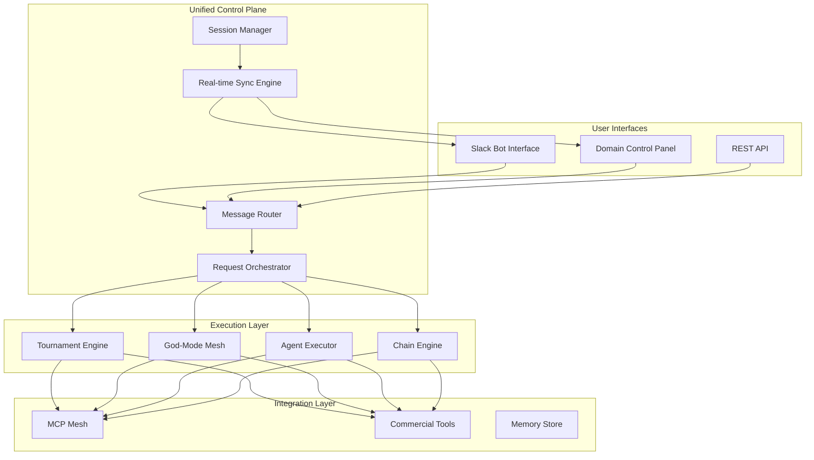
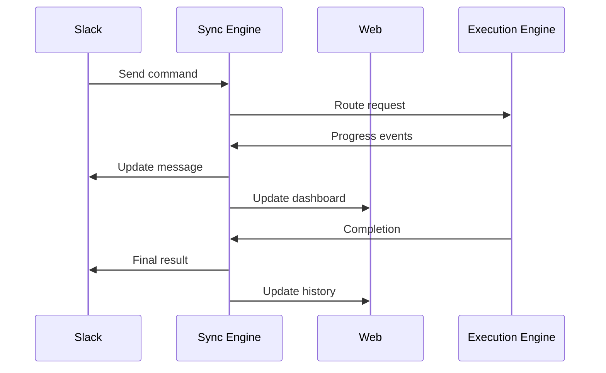
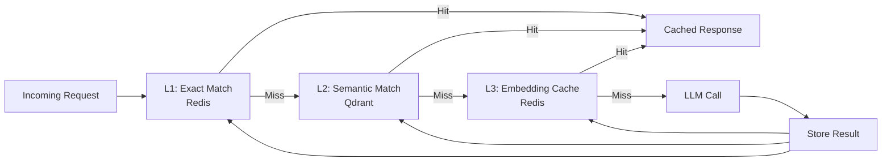
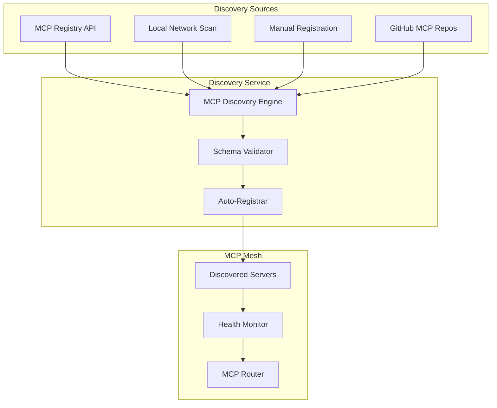
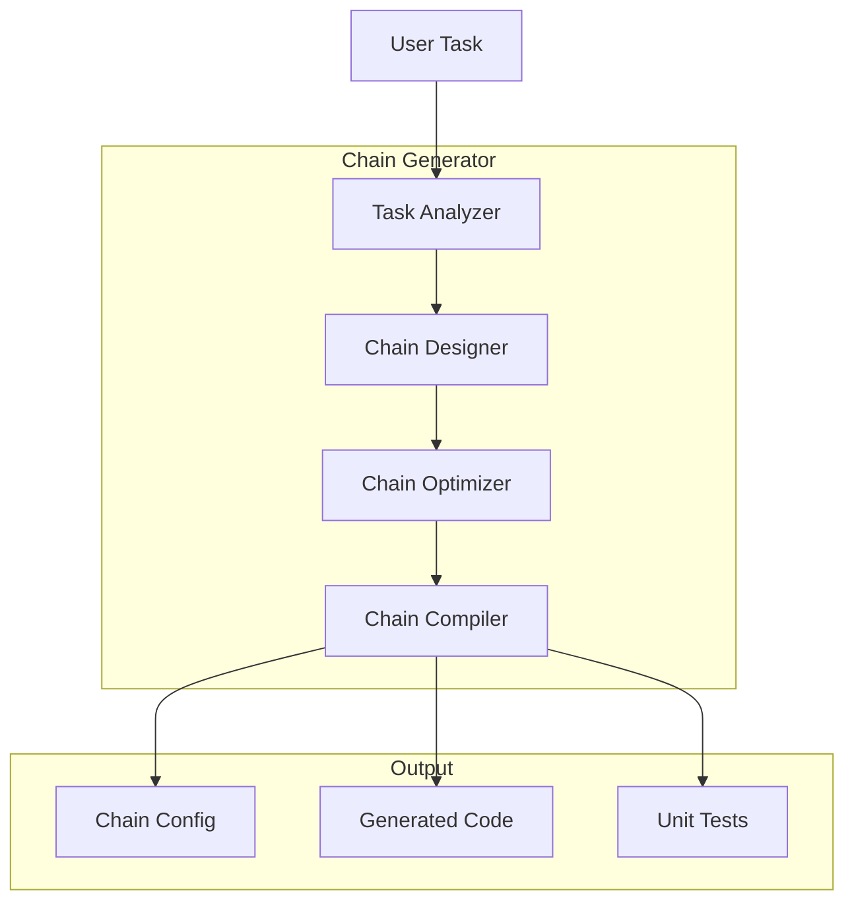
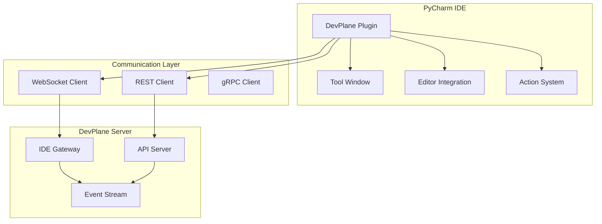

# Unified LLM Control System Architecture

## Executive Summary

This document defines the architectural specification for a unified LLM control system that consolidates the existing DevPlane infrastructure into a single, cohesive platform. The system provides a unified Slack chat interface, domain-based control panel, intelligent cost optimization, self-configuring MCP mesh, and seamless integration with commercial tools (Kilo Code, Antigravity).

**Key Objectives:**
- Single entry point for all operations via Slack
- Consolidated web interface at user's domain
- Best $/token optimization while maintaining SOTA capabilities
- Self-configuring MCP system with LangChain auto-generation
- Commercial tool integration (paid versions only)
- Cloud-hosted, production-grade infrastructure
- Zero degradation of existing capabilities

---

## Table of Contents

1. [Unified Control Plane Architecture](#1-unified-control-plane-architecture)
2. [Token Economics & Cost Optimization Engine](#2-token-economics--cost-optimization-engine)
3. [Self-Configuring MCP Mesh](#3-self-configuring-mcp-mesh)
4. [LangChain Auto-Generation System](#4-langchain-auto-generation-system)
5. [Commercial Tool Integration](#5-commercial-tool-integration)
6. [Implementation Phases](#6-implementation-phases)
7. [Technology Stack](#7-technology-stack)
8. [Data Models](#8-data-models)
9. [API Specifications](#9-api-specifications)

---

## 1. Unified Control Plane Architecture

### 1.1 System Overview

The Unified Control Plane serves as the central nervous system for all LLM operations, providing a single interface layer that abstracts the complexity of the underlying 3-tier execution system (Tournament, God-Mode Mesh, Agent).



### 1.2 Single Slack Interface Design

The Slack interface becomes the primary entry point for all operations, supporting natural language commands that route to appropriate subsystems.

**Command Structure:**

```
@devplane [command] [parameters]
```

**Command Categories:**

| Command | Description | Example |
|---------|-------------|---------|
| `!ask [query]` | General query (auto-routed) | `!ask optimize this Python function` |
| `!mesh [task]` | God-Mode Mesh execution | `!mesh create a REST API for user management` |
| `!tournament [task]` | Tournament mode execution | `!tournament analyze this code` |
| `!agent [agent_name] [task]` | Specific agent execution | `!agent architect design a database schema` |
| `!mcp [server] [action]` | MCP server operations | `!mcp crewai create_crew` |
| `!chain [template] [params]` | Execute chain template | `!chain code_review file.py` |
| `!status` | System status overview | `!status` |
| `!cost` | Current spending report | `!cost today` |
| `!config [key] [value]` | Configuration management | `!config default_tier premium` |

**Slack Bot Architecture:**

```python
# devplane/unified/slack_router.py
class UnifiedSlackRouter:
    """Central router for all Slack interactions."""
    
    def __init__(self):
        self.command_registry = CommandRegistry()
        self.context_manager = ContextManager()
        self.response_formatter = ResponseFormatter()
        
    async def handle_message(self, event: SlackEvent) -> SlackResponse:
        # Extract command and context
        command = self.parse_command(event.text)
        context = await self.context_manager.get_context(event.user_id, event.thread_ts)
        
        # Route to appropriate handler
        handler = self.command_registry.get_handler(command.type)
        result = await handler.execute(command, context)
        
        # Format and return response
        return self.response_formatter.format(result, command.type)
```

**Message Routing Flow:**

1. **Intake**: Slack event received via Socket Mode
2. **Parsing**: Natural language understanding extracts intent
3. **Context Retrieval**: Load user context, conversation history, preferences
4. **Routing Decision**: Determine optimal execution path (tournament/mesh/agent)
5. **Execution**: Delegate to appropriate engine
6. **Response Streaming**: Real-time updates via Slack blocks
7. **Persistence**: Store results, update context

### 1.3 Domain-Based Control Panel Structure

The web control panel provides a unified dashboard for system management, monitoring, and configuration.

**Dashboard Layout:**

```
┌─────────────────────────────────────────────────────────────┐
│  DevPlane Control Panel                    [User] [Settings]│
├──────────┬──────────────────────────────────────────────────┤
│          │                                                  │
│  NAV     │  MAIN CONTENT AREA                               │
│          │                                                  │
│  ├─ Overview                                      │
│  ├─ Mesh Config                                   │
│  ├─ Chain Builder                                   │
│  ├─ MCP Servers                                     │
│  ├─ Cost Analytics                                  │
│  ├─ Agent Registry                                  │
│  ├─ Memory Browser                                    │
│  ├─ Infrastructure                                    │
│  └─ Settings                                        │
│          │                                                  │
│          │                                                  │
└──────────┴──────────────────────────────────────────────────┘
```

**Panel Components:**

| Module | Function | Technology |
|--------|----------|------------|
| Overview | System health, recent activity, cost summary | React + WebSocket |
| Mesh Config | Visual MCP mesh configuration | React Flow |
| Chain Builder | Drag-and-drop chain construction | React Flow + Monaco |
| MCP Servers | Server management and monitoring | React + SSE |
| Cost Analytics | Spending analysis and forecasts | D3.js + React |
| Agent Registry | Agent management and deployment | React + WebSocket |
| Memory Browser | Vector store exploration | React + Canvas |
| Infrastructure | Cloud resource management | React + Status API |

### 1.4 Message Routing and Orchestration

The routing engine uses a multi-factor decision matrix to determine optimal execution paths.

**Routing Decision Matrix:**

```python
# devplane/unified/router.py
class RoutingEngine:
    """Intelligent request routing based on task characteristics."""
    
    async def route_request(self, request: UserRequest) -> ExecutionPlan:
        # Analyze request complexity
        complexity = await self.analyze_complexity(request)
        
        # Check user preferences
        preferences = await self.get_user_preferences(request.user_id)
        
        # Consider cost constraints
        budget_status = await self.check_budget(request.user_id)
        
        # Determine optimal path
        if complexity.score > 0.8 and budget_status.allows_premium:
            return ExecutionPlan(
                mode=ExecutionMode.GOD_MODE_MESH,
                tier=Tier.PREMIUM,
                mcp_servers=self.select_mcp_servers(request),
                estimated_cost=complexity.estimated_cost
            )
        elif complexity.score > 0.5:
            return ExecutionPlan(
                mode=ExecutionMode.TOURNAMENT,
                tier=Tier.MID,
                parallel_tiers=[Tier.CHEAP, Tier.MID],
                escalation_enabled=True
            )
        else:
            return ExecutionPlan(
                mode=ExecutionMode.AGENT,
                tier=Tier.CHEAP,
                fast_mode=True
            )
```

**Routing Factors:**

| Factor | Weight | Description |
|--------|--------|-------------|
| Task Complexity | 0.30 | Code generation vs simple Q&A |
| User Preference | 0.25 | Speed vs quality preference |
| Budget Status | 0.20 | Current spending vs limits |
| Historical Performance | 0.15 | Past success rates by mode |
| Time Constraints | 0.10 | Urgency indicators |

### 1.5 Real-Time Synchronization

All interfaces maintain real-time synchronization using WebSocket connections and event streaming.

**Sync Architecture:**



**Technology Stack:**

| Component | Technology | Purpose |
|-----------|------------|---------|
| WebSocket Server | Socket.io | Bidirectional real-time comms |
| Event Bus | NATS | Message distribution |
| State Sync | Redis | Session state management |
| SSE | Server-Sent Events | One-way streaming updates |

---

## 2. Token Economics & Cost Optimization Engine

### 2.1 Smart Routing Based on Task Complexity

The system uses predictive model selection to choose the most cost-effective model that can handle the task with acceptable quality.

**Complexity Analysis:**

```python
# devplane/economics/complexity_analyzer.py
class ComplexityAnalyzer:
    """Analyze task complexity for optimal model selection."""
    
    async def analyze(self, task: str) -> ComplexityScore:
        features = {
            'token_count': len(task.split()),
            'code_indicators': self.detect_code_keywords(task),
            'reasoning_depth': self.estimate_reasoning_steps(task),
            'domain_complexity': self.assess_domain(task),
            'output_length': self.estimate_output(task)
        }
        
        # Use lightweight model for classification
        classification = await self.classifier.predict(features)
        
        return ComplexityScore(
            score=classification.confidence,
            recommended_tier=self.map_to_tier(classification),
            estimated_tokens=self.estimate_tokens(features),
            confidence=classification.confidence
        )
```

**Complexity Indicators:**

| Indicator | Weight | Detection Method |
|-----------|--------|------------------|
| Code Keywords | 0.25 | Regex matching (function, class, import, etc.) |
| Reasoning Verbs | 0.20 | NLP analysis (analyze, compare, evaluate) |
| Context Length | 0.20 | Token count thresholds |
| Domain Specificity | 0.20 | Domain classifier (legal, medical, technical) |
| Output Format | 0.15 | Structured output requirements |

### 2.2 Predictive Model Selection

Instead of parallel execution, the system predicts the best model and falls back only on failure.

**Model Selection Algorithm:**

```python
# devplane/economics/model_selector.py
class PredictiveModelSelector:
    """Select optimal model based on task and historical performance."""
    
    async def select_model(
        self,
        task: str,
        complexity: ComplexityScore,
        constraints: CostConstraints
    ) -> ModelSelection:
        
        # Get historical performance data
        performance = await self.db.get_performance_metrics(
            task_type=self.classify_task(task),
            complexity_range=complexity.range
        )
        
        # Filter by budget constraints
        candidates = [
            m for m in performance
            if m.estimated_cost <= constraints.max_cost
            and m.success_rate > 0.85
        ]
        
        # Score by efficiency (quality / cost)
        scored = [
            (m, m.quality_score / m.avg_cost)
            for m in candidates
        ]
        
        # Return best option with fallbacks
        return ModelSelection(
            primary=max(scored, key=lambda x: x[1])[0],
            fallbacks=[s[0] for s in scored[1:3]]
        )
```

**Model Performance Matrix:**

| Model | Avg Quality | Avg Cost | Speed | Best For |
|-------|-------------|----------|-------|----------|
| Claude Sonnet 4 | 0.95 | $0.008 | Medium | Complex reasoning |
| DeepSeek Chat | 0.88 | $0.00014 | Fast | Code generation |
| Gemini Flash | 0.82 | $0.00005 | Fast | Simple tasks |
| Groq Llama | 0.80 | $0.00002 | Very Fast | Quick responses |
| GPT-4o | 0.93 | $0.005 | Medium | General purpose |

### 2.3 Semantic Caching Strategy

Implement multi-level caching to avoid redundant LLM calls.

**Cache Architecture:**



**Cache Configuration:**

```python
# devplane/economics/cache_manager.py
class SemanticCache:
    """Multi-level semantic caching system."""
    
    def __init__(self):
        self.exact_cache = RedisCache(ttl=3600)
        self.semantic_cache = QdrantCache(
            similarity_threshold=0.92,
            ttl=86400
        )
        self.embedding_cache = RedisCache(ttl=604800)
        
    async def get(self, query: str) -> Optional[CacheEntry]:
        # L1: Exact match
        key = hashlib.sha256(query.encode()).hexdigest()
        if hit := await self.exact_cache.get(key):
            return hit
            
        # L2: Semantic match
        embedding = await self.get_embedding(query)
        if hit := await self.semantic_cache.search(embedding):
            return hit
            
        return None
```

**Cache Hit Rates (Target):**

| Cache Level | Target Hit Rate | Storage |
|-------------|-----------------|---------|
| L1 Exact | 15% | Redis (1GB) |
| L2 Semantic | 25% | Qdrant (10GB) |
| L3 Embedding | 10% | Redis (5GB) |
| **Total** | **50%** | - |

### 2.4 Cost Attribution Per Agent/Chain

Track costs at granular level for optimization and billing.

**Cost Tracking Schema:**

```python
# devplane/economics/cost_tracker.py
@dataclass
class CostRecord:
    id: str
    timestamp: datetime
    user_id: str
    project_id: str
    agent_id: Optional[str]
    chain_id: Optional[str]
    mcp_server: Optional[str]
    model: str
    provider: str
    input_tokens: int
    output_tokens: int
    cost_usd: float
    execution_time_ms: int
    cache_hit: bool
    
class CostAttribution:
    """Granular cost tracking and attribution."""
    
    async def record_usage(self, record: CostRecord):
        # Store in time-series database
        await self.timeseries_db.write(record)
        
        # Update real-time counters
        await self.update_counters(record)
        
        # Check budget thresholds
        await self.check_thresholds(record)
        
    async def get_cost_report(
        self,
        user_id: str,
        period: TimePeriod
    ) -> CostReport:
        return CostReport(
            total_cost=await self.calculate_total(user_id, period),
            by_agent=await self.breakdown_by_agent(user_id, period),
            by_model=await self.breakdown_by_model(user_id, period),
            by_project=await self.breakdown_by_project(user_id, period),
            trends=await self.calculate_trends(user_id, period)
        )
```

### 2.5 Provider Pool Optimization

Dynamic provider selection based on real-time pricing and performance.

**Provider Pool Manager:**

```python
# devplane/economics/provider_pool.py
class ProviderPool:
    """Manage multiple providers with dynamic optimization."""
    
    def __init__(self):
        self.providers: Dict[str, Provider] = {}
        self.health_checker = HealthChecker()
        self.price_monitor = PriceMonitor()
        
    async def get_optimal_provider(
        self,
        model_requirements: ModelRequirements
    ) -> Provider:
        # Filter healthy providers
        healthy = [
            p for p in self.providers.values()
            if await self.health_checker.is_healthy(p)
        ]
        
        # Score by price and performance
        scored = []
        for provider in healthy:
            price = await self.price_monitor.get_current_price(provider)
            latency = await self.health_checker.get_latency(provider)
            score = self.calculate_score(price, latency, provider.reliability)
            scored.append((provider, score))
        
        return max(scored, key=lambda x: x[1])[0]
```

---

## 3. Self-Configuring MCP Mesh

### 3.1 Dynamic MCP Server Discovery

The system automatically discovers, registers, and configures MCP servers.

**Discovery Architecture:**



**Discovery Implementation:**

```python
# devplane/mcp/discovery.py
class MCPDiscoveryEngine:
    """Automatic discovery and registration of MCP servers."""
    
    async def discover(self) -> List[MCPServerConfig]:
        sources = [
            self.scan_local_network(),
            self.query_registry_api(),
            self.check_manual_registrations(),
            self.scan_github_repos()
        ]
        
        results = await asyncio.gather(*sources)
        discovered = [s for sublist in results for s in sublist]
        
        # Validate and register
        validated = []
        for server in discovered:
            if await self.validate_server(server):
                config = await self.register_server(server)
                validated.append(config)
                
        return validated
        
    async def validate_server(self, server: DiscoveredServer) -> bool:
        """Validate MCP server compatibility."""
        try:
            # Check MCP protocol version
            manifest = await self.fetch_manifest(server.endpoint)
            return manifest.protocol_version >= "2024-11-05"
        except Exception:
            return False
```

### 3.2 Agent-Driven MCP Configuration

Agents can dynamically create and configure MCP servers based on task requirements.

**Auto-Configuration Flow:**

```python
# devplane/mcp/auto_config.py
class MCPAutoConfigurator:
    """Generate MCP configurations based on agent requirements."""
    
    async def generate_config(
        self,
        requirements: MCPRequirements
    ) -> MCPServerConfig:
        # Analyze requirements
        analysis = await self.analyze_requirements(requirements)
        
        # Generate server specification
        spec = await self.generate_specification(analysis)
        
        # Create configuration
        config = MCPServerConfig(
            name=spec.name,
            transport=spec.transport,
            tools=await self.generate_tools(spec),
            resources=await self.generate_resources(spec),
            prompts=await self.generate_prompts(spec)
        )
        
        # Deploy server
        deployment = await self.deploy_server(config)
        
        return deployment
```

### 3.3 Real Framework Integration

Replace mock implementations with real framework integrations.

**Integration Matrix:**

| Framework | Current | Target | Integration Method |
|-----------|---------|--------|-------------------|
| LlamaIndex | Mock | Real | llama-index-mcp package |
| Haystack | Mock | Real | haystack-mcp adapter |
| CrewAI | Mock | Real | crewai-mcp bridge |
| PydanticAI | Mock | Real | pydantic-ai-mcp |
| Semantic Kernel | Mock | Real | semantic-kernel-mcp |

**Real LlamaIndex Integration:**

```python
# devplane/mcp/servers/llamaindex_real.py
from llama_index.core import VectorStoreIndex, SimpleDirectoryReader
from llama_index.embeddings.openai import OpenAIEmbedding
from mcp.server import Server
from mcp.types import Tool, TextContent

class LlamaIndexMCPServer:
    """Real LlamaIndex MCP server implementation."""
    
    def __init__(self):
        self.index = None
        self.embed_model = OpenAIEmbedding()
        
    async def initialize(self):
        """Initialize the LlamaIndex instance."""
        # Load from persistent storage
        storage_path = os.environ.get("LLAMAINDEX_STORAGE", "./storage")
        if os.path.exists(storage_path):
            self.index = await self.load_from_storage(storage_path)
        else:
            self.index = VectorStoreIndex([], embed_model=self.embed_model)
            
    async def query_index(self, query: str) -> str:
        """Query the LlamaIndex vector store."""
        if not self.index:
            return "Error: Index not initialized"
            
        query_engine = self.index.as_query_engine()
        response = await query_engine.aquery(query)
        return str(response)
        
    async def add_documents(self, documents: List[str]) -> str:
        """Add documents to the index."""
        from llama_index.core import Document
        
        docs = [Document(text=doc) for doc in documents]
        for doc in docs:
            self.index.insert(doc)
            
        return f"Added {len(documents)} documents to index"
```

### 3.4 MCP Tool Auto-Discovery

Automatically discover and bind tools from MCP servers.

**Tool Discovery:**

```python
# devplane/mcp/tool_discovery.py
class MCPToolDiscovery:
    """Discover and bind tools from MCP servers."""
    
    async def discover_tools(self, server: MCPServer) -> List[Tool]:
        """Discover all tools from an MCP server."""
        client = MCPClient(server.endpoint)
        
        # List available tools
        tools_response = await client.list_tools()
        
        tools = []
        for tool_def in tools_response.tools:
            tool = Tool(
                name=tool_def.name,
                description=tool_def.description,
                input_schema=tool_def.inputSchema,
                server=server.name,
                handler=self.create_handler(client, tool_def.name)
            )
            tools.append(tool)
            
        return tools
        
    def create_handler(self, client: MCPClient, tool_name: str):
        """Create a handler function for a tool."""
        async def handler(**kwargs) -> str:
            result = await client.call_tool(tool_name, kwargs)
            return self.format_result(result)
        return handler
```

---

## 4. LangChain Auto-Generation System

### 4.1 Agents That Create Their Own Chains

Meta-agents can analyze requirements and generate optimal chain configurations.

**Chain Generation Architecture:**



**Chain Generator Implementation:**

```python
# devplane/chains/generator.py
class ChainGenerator:
    """Generate LangChain chains from natural language requirements."""
    
    async def generate_chain(
        self,
        requirements: str,
        constraints: ChainConstraints
    ) -> GeneratedChain:
        
        # Step 1: Analyze requirements
        analysis = await self.analyze_requirements(requirements)
        
        # Step 2: Design chain structure
        design = await self.design_chain(analysis, constraints)
        
        # Step 3: Optimize for cost/performance
        optimized = await self.optimize_chain(design)
        
        # Step 4: Generate code
        code = await self.generate_code(optimized)
        
        # Step 5: Generate tests
        tests = await self.generate_tests(code)
        
        return GeneratedChain(
            config=optimized,
            code=code,
            tests=tests,
            estimated_cost=self.estimate_cost(optimized)
        )
        
    async def analyze_requirements(self, requirements: str) -> TaskAnalysis:
        """Analyze task requirements using LLM."""
        prompt = f"""
        Analyze the following task requirements and extract:
        1. Task type (classification, generation, transformation, etc.)
        2. Required steps
        3. Input/output formats
        4. Quality requirements
        5. Performance constraints
        
        Requirements: {requirements}
        """
        
        response = await self.llm.complete(prompt)
        return self.parse_analysis(response)
```

### 4.2 Chain Template Library

Pre-built templates for common chain patterns.

**Template Catalog:**

| Template | Description | Use Case |
|----------|-------------|----------|
| `code_review` | Plan → Review → Suggest | Code review automation |
| `document_qa` | Retrieve → Analyze → Answer | Document question answering |
| `data_transform` | Parse → Transform → Validate | ETL pipelines |
| `api_builder` | Design → Implement → Test | API generation |
| `bug_hunter` | Scan → Analyze → Fix | Automated debugging |
| `refactor_pro` | Analyze → Plan → Execute | Code refactoring |

**Template Definition:**

```python
# devplane/chains/templates.py
CHAIN_TEMPLATES = {
    "code_review": ChainTemplate(
        name="code_review",
        description="Comprehensive code review chain",
        steps=[
            StepTemplate(
                name="plan",
                type="planner",
                system_prompt="Create a review plan for the code...",
                model_tier=Tier.MID
            ),
            StepTemplate(
                name="review",
                type="critic",
                system_prompt="Review the code according to the plan...",
                model_tier=Tier.PREMIUM
            ),
            StepTemplate(
                name="suggest",
                type="worker",
                system_prompt="Suggest improvements based on review...",
                model_tier=Tier.MID
            )
        ],
        required_tools=["syntax_checker", "style_analyzer"]
    ),
    
    "api_builder": ChainTemplate(
        name="api_builder",
        description="Generate REST API from requirements",
        steps=[
            StepTemplate(
                name="design",
                type="architect",
                system_prompt="Design API endpoints and data models...",
                model_tier=Tier.PREMIUM
            ),
            StepTemplate(
                name="implement",
                type="worker",
                system_prompt="Implement the API in FastAPI...",
                model_tier=Tier.MID
            ),
            StepTemplate(
                name="test",
                type="executor",
                system_prompt="Generate comprehensive tests...",
                model_tier=Tier.MID
            )
        ]
    )
}
```

### 4.3 Dynamic Chain Composition

Compose chains dynamically from modular components.

**Composition Engine:**

```python
# devplane/chains/composer.py
class ChainComposer:
    """Dynamically compose chains from modular components."""
    
    def __init__(self):
        self.step_library = StepLibrary()
        self.model_registry = ModelRegistry()
        
    async def compose_chain(
        self,
        components: List[ChainComponent],
        config: CompositionConfig
    ) -> ComposedChain:
        
        chain = StateGraph(ChainState)
        
        # Add nodes
        for component in components:
            node = await self.create_node(component)
            chain.add_node(component.name, node)
            
        # Add edges
        for i, component in enumerate(components[:-1]):
            chain.add_edge(
                components[i].name,
                components[i + 1].name
            )
            
        # Add conditional edges if needed
        if config.has_conditionals:
            chain = await self.add_conditionals(chain, config)
            
        return ComposedChain(
            graph=chain.compile(),
            config=config,
            estimated_cost=await self.estimate_cost(chain)
        )
```

### 4.4 Self-Optimizing Chain Patterns

Chains that learn from execution and optimize themselves.

**Optimization Loop:**

```python
# devplane/chains/self_optimize.py
class SelfOptimizingChain:
    """Chain that learns and improves from execution."""
    
    async def execute(self, input_data: dict) -> ChainResult:
        # Load current configuration
        config = await self.load_config()
        
        # Execute with current config
        result = await self.run_with_config(input_data, config)
        
        # Analyze performance
        performance = await self.analyze_performance(result)
        
        # Check if optimization needed
        if performance.score < config.target_score:
            optimized = await self.optimize_config(config, performance)
            await self.save_config(optimized)
            
        return result
        
    async def optimize_config(
        self,
        config: ChainConfig,
        performance: PerformanceMetrics
    ) -> ChainConfig:
        """Optimize chain configuration based on performance."""
        
        optimizations = []
        
        # Optimize model selection
        if performance.latency > config.target_latency:
            optimizations.append(
                await self.optimize_for_speed(config)
            )
            
        # Optimize step ordering
        if performance.quality < config.target_quality:
            optimizations.append(
                await self.optimize_for_quality(config)
            )
            
        # Optimize cost
        if performance.cost > config.target_cost:
            optimizations.append(
                await self.optimize_for_cost(config)
            )
            
        return self.apply_optimizations(config, optimizations)
```

---

## 5. Commercial Tool Integration

### 5.1 Kilo Code Commercial API

Integration with the commercial Kilo Code API for enhanced capabilities.

**Kilo Code Integration:**

```python
# devplane/integrations/kilocode_commercial.py
class KiloCodeCommercialClient:
    """Client for Kilo Code commercial API."""
    
    def __init__(self):
        self.api_key = os.environ["KILOCODE_COMMERCIAL_API_KEY"]
        self.base_url = "https://api.kilocode.com/v1"
        self.client = httpx.AsyncClient(
            base_url=self.base_url,
            headers={"Authorization": f"Bearer {self.api_key}"}
        )
        
    async def execute_task(
        self,
        task: str,
        context: dict,
        mode: str = "code"
    ) -> KiloCodeResult:
        """Execute a task using Kilo Code commercial API."""
        
        response = await self.client.post(
            "/execute",
            json={
                "task": task,
                "context": context,
                "mode": mode,
                "tools": ["file_edit", "terminal", "browser"],
                "max_iterations": 50
            }
        )
        
        return KiloCodeResult(**response.json())
        
    async def get_mode_capabilities(self, mode: str) -> ModeCapabilities:
        """Get capabilities for a specific mode."""
        response = await self.client.get(f"/modes/{mode}/capabilities")
        return ModeCapabilities(**response.json())
```

**Integration Points:**

| Feature | API Endpoint | Usage |
|---------|--------------|-------|
| Code Generation | `/generate` | Complex code generation tasks |
| Code Review | `/review` | Automated code review |
| Refactoring | `/refactor` | Code refactoring operations |
| Test Generation | `/generate-tests` | Unit test creation |
| Documentation | `/document` | Code documentation |

### 5.2 Antigravity Commercial API

Integration with Antigravity commercial services.

**Antigravity Integration:**

```python
# devplane/integrations/antigravity_commercial.py
class AntigravityCommercialClient:
    """Client for Antigravity commercial API."""
    
    def __init__(self):
        self.api_key = os.environ["ANTIGRAVITY_API_KEY"]
        self.base_url = "https://api.antigravity.ai/v2"
        
    async def analyze_codebase(
        self,
        repo_url: str,
        analysis_type: str = "comprehensive"
    ) -> AnalysisResult:
        """Analyze a codebase using Antigravity."""
        
        response = await self.client.post(
            "/analyze",
            json={
                "repository": repo_url,
                "analysis_type": analysis_type,
                "include_dependencies": True,
                "include_security": True
            }
        )
        
        return AnalysisResult(**response.json())
        
    async def generate_architecture(
        self,
        requirements: str,
        constraints: dict
    ) -> ArchitectureProposal:
        """Generate architecture proposal."""
        
        response = await self.client.post(
            "/architecture/generate",
            json={
                "requirements": requirements,
                "constraints": constraints,
                "style": "microservices"
            }
        )
        
        return ArchitectureProposal(**response.json())
```

### 5.3 PyCharm Plugin Architecture

Plugin system for PyCharm integration.

**Plugin Architecture:**



**Plugin Components:**

```kotlin
// PyCharm Plugin - DevPlanePlugin.kt
class DevPlanePlugin : StartupActivity {
    
    private lateinit var client: DevPlaneClient
    private lateinit var toolWindow: DevPlaneToolWindow
    
    override fun runActivity(project: Project) {
        // Initialize connection to DevPlane server
        client = DevPlaneClient(
            serverUrl = getServerUrl(),
            apiKey = getApiKey()
        )
        
        // Setup tool window
        toolWindow = DevPlaneToolWindow(project, client)
        
        // Register editor actions
        registerEditorActions(project)
        
        // Start event listener
        startEventListener()
    }
    
    private fun registerEditorActions(project: Project) {
        // Register "Ask DevPlane" action
        val action = AskDevPlaneAction(client)
        ActionManager.getInstance().registerAction("AskDevPlane", action)
        
        // Register code context menu
        EditorEventMulticaster.getInstance().addEditorMouseListener(
            DevPlaneEditorListener(client)
        )
    }
}
```

### 5.4 Unified Credential Management

Centralized credential management for all commercial tools.

**Credential Vault:**

```python
# devplane/security/credential_manager.py
class UnifiedCredentialManager:
    """Manage credentials for all integrated services."""
    
    def __init__(self):
        self.vault = HashiCorpVault()  # or AWS Secrets Manager
        self.cache = RedisCache()
        
    async def get_credential(
        self,
        service: str,
        credential_type: str = "api_key"
    ) -> Credential:
        """Get credential for a service."""
        
        cache_key = f"cred:{service}:{credential_type}"
        
        # Check cache
        if cached := await self.cache.get(cache_key):
            return Credential(**cached)
            
        # Fetch from vault
        secret = await self.vault.read(f"devplane/{service}/{credential_type}")
        credential = Credential(
            value=secret.data["value"],
            expires_at=secret.data.get("expires_at"),
            metadata=secret.data.get("metadata", {})
        )
        
        # Cache for 5 minutes
        await self.cache.set(cache_key, credential.dict(), ttl=300)
        
        return credential
        
    async def rotate_credential(self, service: str) -> Credential:
        """Rotate credential for a service."""
        
        # Generate new credential via service API
        new_credential = await self.generate_new_credential(service)
        
        # Store in vault
        await self.vault.write(
            f"devplane/{service}/api_key",
            data={
                "value": new_credential.value,
                "created_at": datetime.utcnow().isoformat(),
                "rotated_at": datetime.utcnow().isoformat()
            }
        )
        
        # Invalidate cache
        await self.cache.delete(f"cred:{service}:api_key")
        
        return new_credential
```

---

## 6. Implementation Phases

### Phase 1: Foundation (Weeks 1-4)

**Goal:** Replace mock MCP servers with real implementations and establish unified control plane.

**Deliverables:**

| Week | Task | Owner |
|------|------|-------|
| 1 | Set up MCP server infrastructure | Infrastructure |
| 1 | Implement real LlamaIndex MCP | Backend |
| 2 | Implement real Haystack MCP | Backend |
| 2 | Implement real CrewAI MCP | Backend |
| 3 | Implement real PydanticAI MCP | Backend |
| 3 | Implement real Semantic Kernel MCP | Backend |
| 4 | Unified Slack interface v1 | Backend |
| 4 | Basic domain control panel | Frontend |

**Key Technologies:**
- MCP SDK 1.0+
- LlamaIndex 0.12+
- Haystack 2.0+
- CrewAI 0.100+
- PydanticAI 0.0.20+
- Semantic Kernel 1.0+

### Phase 2: Optimization (Weeks 5-8)

**Goal:** Implement cost optimization engine and semantic caching.

**Deliverables:**

| Week | Task | Owner |
|------|------|-------|
| 5 | Complexity analyzer implementation | ML/Backend |
| 5 | Predictive model selection | ML/Backend |
| 6 | Semantic caching (L1-L3) | Backend |
| 6 | Cost attribution system | Backend |
| 7 | Provider pool optimization | Backend |
| 7 | Cost analytics dashboard | Frontend |
| 8 | Optimization tuning and testing | QA |

**Key Technologies:**
- Redis Cluster
- Qdrant Vector DB
- TimescaleDB
- Prometheus + Grafana

### Phase 3: Intelligence (Weeks 9-12)

**Goal:** Implement LangChain auto-generation and self-configuring MCP mesh.

**Deliverables:**

| Week | Task | Owner |
|------|------|-------|
| 9 | Chain template library | Backend |
| 9 | Chain generator v1 | Backend |
| 10 | Dynamic chain composition | Backend |
| 10 | MCP auto-discovery | Backend |
| 11 | Agent-driven MCP configuration | Backend |
| 11 | Self-optimizing chains | Backend |
| 12 | Chain builder UI | Frontend |

**Key Technologies:**
- LangGraph
- LangChain
- Pydantic v2
- React Flow

### Phase 4: Integration (Weeks 13-16)

**Goal:** Integrate commercial tools and complete PyCharm plugin.

**Deliverables:**

| Week | Task | Owner |
|------|------|-------|
| 13 | Kilo Code commercial integration | Backend |
| 13 | Antigravity integration | Backend |
| 14 | Unified credential management | Security |
| 14 | PyCharm plugin v1 | Plugin Dev |
| 15 | Cross-IDE agent routing | Backend |
| 15 | Commercial tool dashboard | Frontend |
| 16 | End-to-end testing | QA |

**Key Technologies:**
- Kilo Code Commercial API
- Antigravity API
- PyCharm SDK
- Kotlin

---

## 7. Technology Stack

### 7.1 Core Infrastructure

| Layer | Technology | Purpose |
|-------|------------|---------|
| API Gateway | FastAPI + Uvicorn | REST API server |
| WebSocket | Socket.io | Real-time communication |
| Message Bus | NATS | Event streaming |
| Cache | Redis Cluster | Distributed caching |
| Database | SQLite + aiosqlite | Primary data store |
| Vector DB | Qdrant | Semantic search |
| Time-Series | TimescaleDB | Metrics storage |

### 7.2 AI/ML Stack

| Component | Technology | Purpose |
|-----------|------------|---------|
| LLM Router | LiteLLM | Multi-provider LLM access |
| Chain Engine | LangGraph | Workflow orchestration |
| Embeddings | OpenAI / Local | Text embeddings |
| Framework | LangChain | Chain composition |
| Agent Framework | Custom + LangGraph | Agent execution |

### 7.3 Frontend Stack

| Component | Technology | Purpose |
|-----------|------------|---------|
| Framework | React 18 | UI framework |
| State | Zustand | State management |
| Styling | Tailwind CSS | Styling |
| Visualization | React Flow | Node graphs |
| Charts | D3.js + Recharts | Data visualization |
| Editor | Monaco Editor | Code editing |

### 7.4 DevOps Stack

| Component | Technology | Purpose |
|-----------|------------|---------|
| Container | Docker + Compose | Containerization |
| Orchestration | Docker Swarm / K8s | Container orchestration |
| Monitoring | Prometheus + Grafana | Metrics |
| Logging | Loki + Grafana | Log aggregation |
| CI/CD | GitHub Actions | Automation |
| IaC | Terraform | Infrastructure provisioning |

---

## 8. Data Models

### 8.1 Core Entities

```python
# Unified data models for the LLM control system

from pydantic import BaseModel, Field
from typing import Optional, List, Dict, Any
from datetime import datetime
from enum import Enum

class ExecutionMode(str, Enum):
    TOURNAMENT = "tournament"
    MESH = "mesh"
    AGENT = "agent"
    CHAIN = "chain"

class Tier(str, Enum):
    CHEAP = "cheap"
    MID = "mid"
    PREMIUM = "premium"

class UserRequest(BaseModel):
    """User request entity."""
    id: str = Field(default_factory=uuid.uuid4)
    user_id: str
    session_id: str
    query: str
    context: Dict[str, Any] = {}
    preferred_mode: Optional[ExecutionMode] = None
    timestamp: datetime = Field(default_factory=datetime.utcnow)
    
class ExecutionPlan(BaseModel):
    """Execution plan generated by router."""
    request_id: str
    mode: ExecutionMode
    tier: Tier
    mcp_servers: List[str] = []
    models: List[str] = []
    estimated_cost: float
    estimated_time_ms: int
    fallbacks: List[str] = []
    
class ExecutionResult(BaseModel):
    """Result of execution."""
    request_id: str
    status: str  # success, error, timeout
    output: str
    cost: float
    duration_ms: int
    model_used: str
    steps: List[Dict[str, Any]] = []
    cache_hit: bool = False
    timestamp: datetime = Field(default_factory=datetime.utcnow)
    
class MCPServer(BaseModel):
    """MCP server entity."""
    id: str
    name: str
    endpoint: str
    transport: str  # stdio, sse, http
    status: str  # active, inactive, error
    tools: List[Dict[str, Any]] = []
    resources: List[Dict[str, Any]] = []
    last_health_check: Optional[datetime] = None
    
class ChainTemplate(BaseModel):
    """Chain template entity."""
    id: str
    name: str
    description: str
    steps: List[ChainStep]
    required_tools: List[str] = []
    estimated_cost_range: tuple[float, float]
    tags: List[str] = []
    
class ChainStep(BaseModel):
    """Chain step definition."""
    name: str
    type: str  # planner, executor, reviewer, etc.
    system_prompt: str
    model_tier: Tier
    timeout_seconds: int = 60
    condition: Optional[str] = None  # Conditional execution
    
class CostRecord(BaseModel):
    """Cost tracking record."""
    id: str
    timestamp: datetime
    user_id: str
    project_id: str
    request_id: str
    model: str
    provider: str
    input_tokens: int
    output_tokens: int
    cost_usd: float
    cache_hit: bool = False
    
class CacheEntry(BaseModel):
    """Cache entry for semantic caching."""
    id: str
    query_hash: str
    query_embedding: List[float]
    response: str
    model: str
    cost: float
    timestamp: datetime
    access_count: int = 0
    ttl: int = 86400
```

### 8.2 Database Schema

```sql
-- Core tables for unified LLM control system

-- User requests
CREATE TABLE user_requests (
    id TEXT PRIMARY KEY,
    user_id TEXT NOT NULL,
    session_id TEXT NOT NULL,
    query TEXT NOT NULL,
    context_json TEXT DEFAULT '{}',
    preferred_mode TEXT,
    created_at TIMESTAMP DEFAULT CURRENT_TIMESTAMP
);

-- Execution plans
CREATE TABLE execution_plans (
    id TEXT PRIMARY KEY,
    request_id TEXT REFERENCES user_requests(id),
    mode TEXT NOT NULL,
    tier TEXT NOT NULL,
    mcp_servers_json TEXT DEFAULT '[]',
    models_json TEXT DEFAULT '[]',
    estimated_cost REAL,
    estimated_time_ms INTEGER,
    fallbacks_json TEXT DEFAULT '[]',
    created_at TIMESTAMP DEFAULT CURRENT_TIMESTAMP
);

-- Execution results
CREATE TABLE execution_results (
    id TEXT PRIMARY KEY,
    request_id TEXT REFERENCES user_requests(id),
    status TEXT NOT NULL,
    output TEXT,
    cost REAL,
    duration_ms INTEGER,
    model_used TEXT,
    steps_json TEXT DEFAULT '[]',
    cache_hit BOOLEAN DEFAULT FALSE,
    created_at TIMESTAMP DEFAULT CURRENT_TIMESTAMP
);

-- MCP servers
CREATE TABLE mcp_servers (
    id TEXT PRIMARY KEY,
    name TEXT UNIQUE NOT NULL,
    endpoint TEXT NOT NULL,
    transport TEXT DEFAULT 'stdio',
    status TEXT DEFAULT 'inactive',
    tools_json TEXT DEFAULT '[]',
    resources_json TEXT DEFAULT '[]',
    last_health_check TIMESTAMP,
    created_at TIMESTAMP DEFAULT CURRENT_TIMESTAMP,
    updated_at TIMESTAMP DEFAULT CURRENT_TIMESTAMP
);

-- Chain templates
CREATE TABLE chain_templates (
    id TEXT PRIMARY KEY,
    name TEXT UNIQUE NOT NULL,
    description TEXT,
    steps_json TEXT NOT NULL,
    required_tools_json TEXT DEFAULT '[]',
    estimated_cost_min REAL,
    estimated_cost_max REAL,
    tags_json TEXT DEFAULT '[]',
    created_at TIMESTAMP DEFAULT CURRENT_TIMESTAMP
);

-- Semantic cache
CREATE TABLE semantic_cache (
    id TEXT PRIMARY KEY,
    query_hash TEXT UNIQUE NOT NULL,
    query_embedding BLOB NOT NULL,
    response TEXT NOT NULL,
    model TEXT NOT NULL,
    cost REAL,
    access_count INTEGER DEFAULT 0,
    created_at TIMESTAMP DEFAULT CURRENT_TIMESTAMP,
    expires_at TIMESTAMP NOT NULL
);

-- Cost tracking
CREATE TABLE cost_records (
    id TEXT PRIMARY KEY,
    timestamp TIMESTAMP DEFAULT CURRENT_TIMESTAMP,
    user_id TEXT NOT NULL,
    project_id TEXT NOT NULL,
    request_id TEXT REFERENCES user_requests(id),
    model TEXT NOT NULL,
    provider TEXT NOT NULL,
    input_tokens INTEGER,
    output_tokens INTEGER,
    cost_usd REAL,
    cache_hit BOOLEAN DEFAULT FALSE
);

-- Indexes for performance
CREATE INDEX idx_requests_user ON user_requests(user_id);
CREATE INDEX idx_requests_session ON user_requests(session_id);
CREATE INDEX idx_results_request ON execution_results(request_id);
CREATE INDEX idx_cost_user_time ON cost_records(user_id, timestamp);
CREATE INDEX idx_cache_hash ON semantic_cache(query_hash);
CREATE INDEX idx_cache_expires ON semantic_cache(expires_at);
```

---

## 9. API Specifications

### 9.1 REST API Endpoints

```yaml
# OpenAPI 3.0 specification for Unified LLM Control System

openapi: 3.0.0
info:
  title: Unified LLM Control System API
  version: 1.0.0
  description: API for unified LLM control and orchestration

paths:
  /api/v1/execute:
    post:
      summary: Execute a task
      requestBody:
        content:
          application/json:
            schema:
              type: object
              properties:
                query:
                  type: string
                mode:
                  type: string
                  enum: [tournament, mesh, agent, chain]
                context:
                  type: object
                preferred_tier:
                  type: string
                  enum: [cheap, mid, premium]
      responses:
        200:
          description: Execution result
          content:
            application/json:
              schema:
                $ref: '#/components/schemas/ExecutionResult'

  /api/v1/mcp/servers:
    get:
      summary: List MCP servers
      responses:
        200:
          description: List of MCP servers
          content:
            application/json:
              schema:
                type: array
                items:
                  $ref: '#/components/schemas/MCPServer'
    
    post:
      summary: Register MCP server
      requestBody:
        content:
          application/json:
            schema:
              $ref: '#/components/schemas/MCPServer'
      responses:
        201:
          description: Server registered

  /api/v1/chains/templates:
    get:
      summary: List chain templates
      responses:
        200:
          description: List of templates
          content:
            application/json:
              schema:
                type: array
                items:
                  $ref: '#/components/schemas/ChainTemplate'
    
    post:
      summary: Create chain template
      requestBody:
        content:
          application/json:
            schema:
              $ref: '#/components/schemas/ChainTemplate'
      responses:
        201:
          description: Template created

  /api/v1/chains/generate:
    post:
      summary: Generate chain from requirements
      requestBody:
        content:
          application/json:
            schema:
              type: object
              properties:
                requirements:
                  type: string
                constraints:
                  type: object
      responses:
        200:
          description: Generated chain
          content:
            application/json:
              schema:
                type: object
                properties:
                  config:
                    type: object
                  code:
                    type: string
                  estimated_cost:
                    type: number

  /api/v1/cost/summary:
    get:
      summary: Get cost summary
      parameters:
        - name: period
          in: query
          schema:
            type: string
            enum: [day, week, month]
      responses:
        200:
          description: Cost summary
          content:
            application/json:
              schema:
                type: object
                properties:
                  total_cost:
                    type: number
                  by_model:
                    type: object
                  by_project:
                    type: object
                  trends:
                    type: array

  /api/v1/cache/clear:
    post:
      summary: Clear semantic cache
      responses:
        200:
          description: Cache cleared

components:
  schemas:
    ExecutionResult:
      type: object
      properties:
        request_id:
          type: string
        status:
          type: string
        output:
          type: string
        cost:
          type: number
        duration_ms:
          type: integer
        model_used:
          type: string
        steps:
          type: array
          items:
            type: object
        cache_hit:
          type: boolean

    MCPServer:
      type: object
      properties:
        id:
          type: string
        name:
          type: string
        endpoint:
          type: string
        transport:
          type: string
        status:
          type: string
        tools:
          type: array
          items:
            type: object
        resources:
          type: array
          items:
            type: object

    ChainTemplate:
      type: object
      properties:
        id:
          type: string
        name:
          type: string
        description:
          type: string
        steps:
          type: array
          items:
            type: object
        required_tools:
          type: array
          items:
            type: string
        estimated_cost_range:
          type: array
          items:
            type: number
```

### 9.2 WebSocket Events

```typescript
// WebSocket event definitions

interface WebSocketEvents {
  // Client -> Server
  'request:execute': {
    requestId: string;
    query: string;
    mode?: ExecutionMode;
    context?: Record<string, any>;
  };
  
  'request:cancel': {
    requestId: string;
  };
  
  'mcp:discover': {
    endpoint?: string;
  };
  
  // Server -> Client
  'execution:started': {
    requestId: string;
    plan: ExecutionPlan;
    timestamp: string;
  };
  
  'execution:progress': {
    requestId: string;
    step: string;
    status: 'running' | 'complete' | 'error';
    details?: Record<string, any>;
  };
  
  'execution:complete': {
    requestId: string;
    result: ExecutionResult;
    timestamp: string;
  };
  
  'execution:error': {
    requestId: string;
    error: string;
    timestamp: string;
  };
  
  'mcp:discovered': {
    servers: MCPServer[];
  };
  
  'mcp:status': {
    serverId: string;
    status: 'active' | 'inactive' | 'error';
    lastCheck: string;
  };
  
  'cost:update': {
    userId: string;
    dailyCost: number;
    monthlyCost: number;
    budgetRemaining: number;
  };
}
```

---

## Appendix A: Cost Projections

### A.1 Infrastructure Costs (Monthly)

| Service | Tier | Cost/Month |
|---------|------|------------|
| DigitalOcean Droplet | 4GB RAM, 2vCPU | $24 |
| Redis Cloud | 1GB | $20 |
| Qdrant Cloud | 1GB | $25 |
| NATS Cloud | Basic | $15 |
| Cloudflare | Pro Plan | $20 |
| **Total Infrastructure** | | **$104** |

### A.2 LLM API Costs (Estimated)

| Usage Level | Daily Requests | Avg Tokens | Monthly Cost |
|-------------|----------------|------------|--------------|
| Light | 100 | 2K | $50 |
| Medium | 500 | 5K | $300 |
| Heavy | 2000 | 10K | $1,200 |

### A.3 Commercial Tool Costs

| Tool | Plan | Cost/Month |
|------|------|------------|
| Kilo Code Commercial | Pro | $50 |
| Antigravity | Business | $100 |
| PyCharm Professional | Individual | $25 |
| **Total Commercial** | | **$175** |

---

## Appendix B: Security Considerations

### B.1 Authentication & Authorization

- OAuth 2.0 / OIDC for user authentication
- JWT tokens with short expiration
- Role-based access control (RBAC)
- API key management with rotation

### B.2 Data Protection

- Encryption at rest (AES-256)
- TLS 1.3 for all communications
- Secrets management via HashiCorp Vault
- PII detection and masking

### B.3 Audit Logging

- All API calls logged
- Model usage tracked
- Cost attribution per user
- Compliance reporting

---

## Appendix C: Monitoring & Alerting

### C.1 Key Metrics

| Metric | Target | Alert Threshold |
|--------|--------|-----------------|
| API Response Time | < 500ms | > 1s |
| LLM Latency | < 2s | > 5s |
| Error Rate | < 1% | > 5% |
| Cache Hit Rate | > 40% | < 20% |
| Daily Cost | < $50 | > $75 |

### C.2 Alert Channels

- Slack notifications
- PagerDuty integration
- Email alerts
- Dashboard alerts

---

*Document Version: 1.0*
*Last Updated: 2026-03-09*
*Author: DevPlane Architecture Team*
